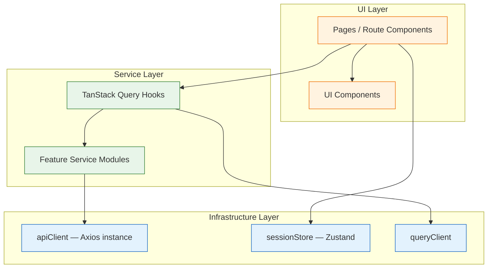
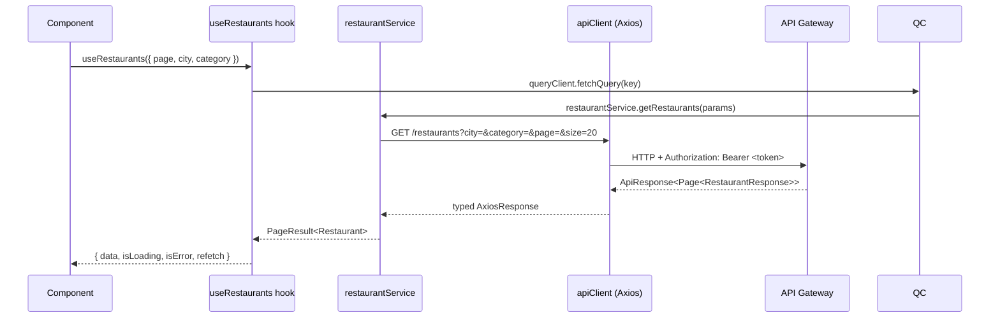
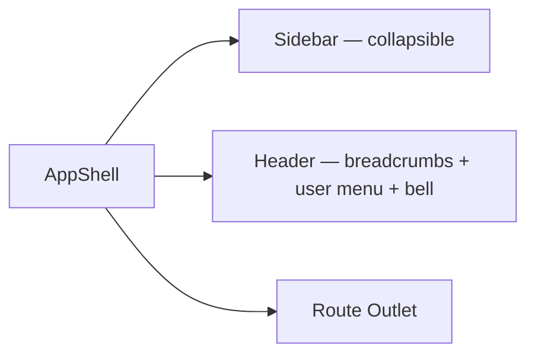
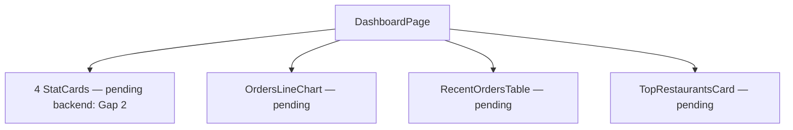

# Design Document — Admin Web Dashboard

## Overview

The Admin Web Dashboard is the administrator-facing React client of the existing Food Delivery Platform. It communicates with Spring Boot microservices through a single Spring Cloud Gateway base URL. The gateway enforces JWT authentication on every route except `/auth/**` and injects `X-User-*` identity headers downstream. Administrator tokens carry the `ADMIN` role.

This document specifies the architecture, layering, networking, state management, routing, component structure, theming, per-feature design, gap-handling strategy, and testing approach needed to satisfy all 21 requirements in `requirements.md`. It is a design document.

### Design Goals

- **Gap-first architecture.** Most admin capabilities have no backend endpoint today. Every management screen is built behind a service interface so that mock/placeholder implementations can be swapped for real API calls without changing any UI component.
- **Single auth seam.** One Axios interceptor attaches the JWT; one response interceptor handles 401. A future refresh flow drops in at that one point.
- **Type safety end to end.** Every API response has a TypeScript type; every form has a Zod schema. No `any`.
- **Server state vs. client state separation.** TanStack Query owns all async server data (caching, refetching, deduplication). Zustand owns synchronous client state (session, theme, sidebar collapse).
- **Testability.** All pure functions (permission checks, filter builders, pagination calculators) are isolated from I/O for unit-test coverage with Vitest.

### Key Design Decisions

| Decision | Choice | Rationale |
|---|---|---|
| Build tool | Vite | Fast HMR, native ESM, code-splitting via dynamic `import()`. |
| Server state | TanStack Query v5 | Stale-while-revalidate, per-query invalidation, deduplication — satisfies Req 19 caching requirement. |
| Client state | Zustand | Minimal boilerplate; session, theme, sidebar collapse are simple slices that do not need Redux machinery. |
| Routing | React Router v6 (`createBrowserRouter`) | Data loaders, nested routes, declarative auth guard via `loader` + `redirect`. |
| HTTP | Axios + interceptors | First-class request/response interceptors for single-seam auth attachment and 401 handling; `AbortController` for cancellation (Req 16.7). |
| UI components | shadcn/ui (Radix + Tailwind) | Accessible, unstyled primitives with Tailwind customisation; no runtime CSS-in-JS. |
| Forms | React Hook Form + Zod | Type-safe validation, minimal re-renders, schema-driven error messages. |
| Tables | TanStack Table v8 + @tanstack/react-virtual | Server-side pagination/sort/filter with virtual row rendering for large datasets (Req 19.2). |
| Charts | Recharts | Composable, React-native charts; zero external dependencies beyond React. |
| Testing | Vitest + React Testing Library + MSW | `msw` for API mocking; RTL for component tests; Vitest for unit/property tests. |
| Money | No special type (server returns strings) | Future earnings/revenue endpoints should return monetary fields as strings; parse to JS `string` and format with `Intl.NumberFormat`. |

---

## Architecture

### Layered Architecture

The Admin Dashboard uses a feature-first folder structure with three conceptual layers that mirror the backend's Clean Architecture in spirit — without the rigid DI framework:

- **UI Layer** — React components and pages. Reads from TanStack Query hooks and Zustand stores. Dispatches mutations. Never calls Axios directly.
- **Service Layer** — Per-feature service modules that call `apiClient` methods and return typed data. TanStack Query hooks wrap these. This is the seam where placeholder implementations live.
- **Infrastructure Layer** — `apiClient` (Axios instance + interceptors), `sessionStore` (Zustand), `queryClient` (TanStack Query), and utility functions. No business logic here.



### Request Flow (authenticated)



---

## State Management

### TanStack Query — Server State

All data fetched from the backend is owned by TanStack Query. Key conventions:

- **Query keys** are arrays structured as `[feature, resource, params]`, e.g. `['restaurants', 'list', { page, city, category }]`. This makes per-page or per-resource invalidation precise.
- **`staleTime`** is set to 60 seconds globally so that navigating back to a visited page shows cached data immediately while a background refetch runs (Req 19.1).
- **`gcTime`** (formerly `cacheTime`) is set to 5 minutes.
- **Mutations** call `queryClient.invalidateQueries` on success to ensure consistency.
- **Pagination** uses `keepPreviousData: true` so the table does not flash empty while the next page loads.
- **Deduplication:** Multiple components mounting the same query key result in exactly one HTTP call (Req 19.4).

```typescript
// Example query hook
export function useRestaurants(params: RestaurantListParams) {
  return useQuery({
    queryKey: ['restaurants', 'list', params],
    queryFn: () => restaurantService.getRestaurants(params),
    staleTime: 60_000,
    placeholderData: keepPreviousData,
  });
}
```

### Zustand — Client State

Three lightweight stores; each is a single file with no inter-store dependencies:

```typescript
// sessionStore — AdminSession + auth actions
interface SessionStore {
  session: AdminSession | null;
  setSession: (session: AdminSession | null) => void;
  clearSession: () => void;
}

// themeStore — light | dark | system
interface ThemeStore {
  theme: 'light' | 'dark' | 'system';
  setTheme: (theme: ThemeMode) => void;
}

// uiStore — sidebar, notifications panel
interface UIStore {
  sidebarCollapsed: boolean;
  toggleSidebar: () => void;
  notificationPanelOpen: boolean;
  toggleNotificationPanel: () => void;
}
```

---

## Networking Layer

### Axios Instance and Interceptor Chain

One Axios instance is created at module initialisation and shared across all service modules.

```typescript
// src/lib/api-client.ts
const apiClient = axios.create({
  baseURL: import.meta.env.VITE_API_BASE_URL,
  timeout: 15_000,
  headers: { 'Content-Type': 'application/json' },
});

// Request interceptor — attach JWT
apiClient.interceptors.request.use((config) => {
  const token = sessionStore.getState().session?.token;
  if (token && !config.url?.startsWith('/auth/')) {
    config.headers.Authorization = `Bearer ${token}`;
  }
  return config;
});

// Response interceptor — single 401 seam
apiClient.interceptors.response.use(
  (res) => res,
  (error: AxiosError) => {
    if (error.response?.status === 401 && !error.config?.url?.startsWith('/auth/')) {
      sessionStore.getState().clearSession();
      window.location.href = '/login?reason=session_expired';
    }
    return Promise.reject(mapAxiosError(error));
  }
);
```

### Error Mapping

```typescript
type AppError =
  | { type: 'no_connection' }
  | { type: 'timeout' }
  | { type: 'unauthorized' }
  | { type: 'server'; status: number }
  | { type: 'client'; status: number; message: string; fieldErrors?: Record<string, string> }
  | { type: 'rate_limit' }
  | { type: 'unknown'; message: string };

function mapAxiosError(error: AxiosError): AppError { /* ... */ }
```

### ApiResponse and PageResponse Decoders

```typescript
// Wraps restaurant-service responses: { success, message, data }
async function unwrapApiResponse<T>(promise: Promise<AxiosResponse<ApiResponseDto<T>>>): Promise<T> {
  const { data } = await promise;
  if (!data.success) throw new Error(data.message);
  return data.data;
}

// Spring Page<T> shape
interface PageResult<T> {
  content: T[];
  page: number;
  size: number;
  totalElements: number;
  totalPages: number;
  last: boolean;
  first: boolean;
}
```

### Request Cancellation

Components pass an `AbortController.signal` via `{ signal }` in Axios config. TanStack Query automatically cancels in-flight requests when a query is unmounted (Req 16.7).

---

## Routing

### React Router v6 Structure

```typescript
createBrowserRouter([
  {
    path: '/login',
    element: <LoginPage />,
  },
  {
    path: '/',
    element: <AuthGuard />,          // loader: redirect to /login if no valid session
    children: [
      {
        element: <AppShell />,        // sidebar + header + outlet
        children: [
          { index: true, element: <Navigate to="/dashboard" /> },
          { path: 'dashboard', element: <DashboardPage /> },
          { path: 'restaurants', element: <RestaurantListPage /> },
          { path: 'restaurants/:id', element: <RestaurantDetailPage /> },
          { path: 'orders', element: <OrderListPage /> },
          { path: 'orders/:id', element: <OrderDetailPage /> },
          { path: 'delivery-partners', element: <DeliveryPartnerListPage /> },
          { path: 'delivery-partners/:id', element: <DeliveryPartnerDetailPage /> },
          { path: 'customers', element: <CustomerListPage /> },
          { path: 'customers/:id', element: <CustomerDetailPage /> },
          { path: 'analytics', element: <AnalyticsPage /> },
          { path: 'notifications', element: <NotificationsPage /> },
          { path: 'settings', element: <SettingsPage /> },
        ],
      },
    ],
  },
])
```

### AuthGuard Loader

```typescript
const authGuardLoader = () => {
  const { session } = sessionStore.getState();
  if (!session || isTokenExpired(session.exp)) {
    sessionStore.getState().clearSession();
    return redirect('/login');
  }
  return null;
};
```

---

## Folder Structure

```text
src/
├── main.tsx                        # ReactDOM.createRoot, QueryClientProvider, RouterProvider
├── app.tsx                         # theme wiring (class on <html>)
├── lib/
│   ├── api-client.ts               # Axios instance + interceptors
│   ├── query-client.ts             # TanStack QueryClient config
│   ├── error-mapper.ts             # AxiosError → AppError
│   ├── api-response.ts             # unwrapApiResponse, PageResult decoder
│   └── token-utils.ts             # JWT decode, isTokenExpired
├── stores/
│   ├── session-store.ts            # Zustand: AdminSession, setSession, clearSession
│   ├── theme-store.ts              # Zustand: ThemeMode, setTheme
│   └── ui-store.ts                 # Zustand: sidebarCollapsed, notificationPanel
├── types/
│   ├── api.ts                      # ApiResponseDto<T>, PageResult<T>, AppError
│   ├── auth.ts                     # AuthResponseDto, AdminSession
│   ├── restaurant.ts               # RestaurantDto, CategoryDto, MenuItemDto
│   ├── order.ts                    # OrderDto, OrderItemDto, OrderStatus enum
│   ├── delivery.ts                 # DeliveryPartnerDto, DeliveryAssignmentDto
│   ├── customer.ts                 # CustomerDto
│   └── analytics.ts               # AnalyticsSummaryDto, RevenuePointDto (future)
├── services/
│   ├── auth.service.ts             # login()
│   ├── restaurant.service.ts       # getRestaurants(), getRestaurantById(), searchRestaurants()
│   ├── order.service.ts            # PLACEHOLDER — Gap 4
│   ├── delivery.service.ts         # PLACEHOLDER — Gap 5
│   ├── customer.service.ts         # PLACEHOLDER — Gap 6
│   └── analytics.service.ts       # PLACEHOLDER — Gap 7
├── hooks/
│   ├── use-session.ts              # reads sessionStore
│   ├── use-restaurants.ts          # useRestaurants(), useRestaurantById()
│   ├── use-orders.ts               # useOrders() — placeholder
│   ├── use-delivery-partners.ts    # useDeliveryPartners() — placeholder
│   ├── use-customers.ts            # useCustomers() — placeholder
│   └── use-analytics.ts           # useAnalytics() — placeholder
├── router/
│   ├── index.tsx                   # createBrowserRouter
│   └── auth-guard.tsx              # AuthGuard with loader
├── components/
│   ├── layout/
│   │   ├── app-shell.tsx           # sidebar + header + outlet
│   │   ├── sidebar.tsx             # navigation links
│   │   └── header.tsx              # breadcrumbs + user menu + notifications bell
│   ├── ui/                         # shadcn/ui component re-exports + customisations
│   │   ├── data-table.tsx          # TanStack Table wrapper (sort, paginate, virtual)
│   │   ├── stat-card.tsx           # metric card (value, label, trend)
│   │   ├── skeleton-table.tsx      # loading skeleton for data tables
│   │   ├── skeleton-cards.tsx      # loading skeleton for metric cards
│   │   ├── error-state.tsx         # error + retry
│   │   ├── empty-state.tsx         # empty result
│   │   ├── pending-feature.tsx     # backend gap placeholder
│   │   ├── status-badge.tsx        # colored OrderStatus chip
│   │   ├── page-header.tsx         # title + breadcrumbs + actions
│   │   └── confirm-dialog.tsx      # reusable confirmation modal
│   └── charts/
│       ├── orders-line-chart.tsx   # daily orders line chart (Recharts)
│       ├── revenue-bar-chart.tsx   # restaurant revenue bar chart
│       └── status-pie-chart.tsx    # order status distribution
├── features/
│   ├── auth/
│   │   ├── login-page.tsx
│   │   └── use-login.ts            # useMutation wrapper for auth.service.login
│   ├── dashboard/
│   │   └── dashboard-page.tsx
│   ├── restaurants/
│   │   ├── restaurant-list-page.tsx
│   │   ├── restaurant-detail-page.tsx
│   │   └── restaurant-filters.tsx
│   ├── orders/
│   │   ├── order-list-page.tsx
│   │   ├── order-detail-page.tsx
│   │   └── order-status-override-dialog.tsx
│   ├── delivery-partners/
│   │   ├── delivery-partner-list-page.tsx
│   │   └── delivery-partner-detail-page.tsx
│   ├── customers/
│   │   ├── customer-list-page.tsx
│   │   └── customer-detail-page.tsx
│   ├── analytics/
│   │   └── analytics-page.tsx
│   ├── notifications/
│   │   └── notifications-page.tsx
│   └── settings/
│       └── settings-page.tsx
├── utils/
│   ├── format.ts                   # currency, date, percent formatters (Intl)
│   ├── pagination.ts               # page-count, offset calculators (pure)
│   └── filter-builder.ts          # builds URLSearchParams from filter objects (pure)
└── test/
    ├── setup.ts                    # vitest setup, MSW server
    ├── mocks/
    │   └── handlers.ts             # MSW request handlers
    └── utils.tsx                   # renderWithProviders helper
```

---

## Type Catalog

### Auth Types (verified against backend)

```typescript
// POST /auth/login/admin → AuthResponseDto
interface AuthResponseDto {
  token: string;
  userId: string;      // adminId
  fullName: string;
  email: string;
  role: 'ADMIN';
}

interface AdminSession {
  token: string;
  adminId: string;
  name: string;
  email: string;
  role: 'ADMIN';
  exp: number;         // seconds since epoch
}
```

### Restaurant Types (verified against backend)

```typescript
// GET /restaurants/{id} → ApiResponse<RestaurantResponse>
interface RestaurantDto {
  id: string;
  name: string;
  description: string | null;
  city: string;
  address: string;
  phone: string | null;
  latitude: number;
  longitude: number;
  isOpen: boolean;
  isDeleted: boolean;
  categories: CategoryDto[];
  coverImageUrl: string | null;
  logoUrl: string | null;
  createdAt: string;   // raw ISO string
}

interface CategoryDto {
  id: string;
  name: string;
  items: MenuItemDto[];
}

interface MenuItemDto {
  id: string;
  name: string;
  description: string | null;
  price: string;       // BigDecimal → string
  available: boolean;
  vegetarian: boolean;
  imageUrl: string | null;
}

// Spring Page<T> → PageResult<T>
interface PageResult<T> {
  content: T[];
  page: number;
  size: number;
  totalElements: number;
  totalPages: number;
  last: boolean;
  first: boolean;
}
```

### Placeholder Types (future endpoints)

```typescript
// Placeholder — Gap 4 — GET /admin/orders
interface OrderDto {
  id: string;
  customerId: string;
  customerName: string;
  restaurantId: string;
  restaurantName: string;
  subtotal: string;
  deliveryFee: string;
  tax: string;
  totalAmount: string;
  status: OrderStatus;
  items: OrderItemDto[];
  deliveryAddress: string;
  createdAt: string;
}

type OrderStatus = 'PENDING_PAYMENT' | 'CONFIRMED' | 'PREPARING' |
  'READY_FOR_PICKUP' | 'DELIVERY_PARTNER_ASSIGNED' |
  'OUT_FOR_DELIVERY' | 'DELIVERED' | 'CANCELLED' | 'FAILED';

// Placeholder — Gap 5 — GET /admin/delivery-partners
interface DeliveryPartnerDto {
  id: string;
  fullName: string;
  email: string;
  phone: string;
  isOnline: boolean;
  isAvailable: boolean;
  currentAssignmentId: string | null;
  totalDeliveries: number;
  createdAt: string;
}

// Placeholder — Gap 6 — GET /admin/customers
interface CustomerDto {
  id: string;
  fullName: string;
  email: string;
  phone: string;
  totalOrders: number;
  totalSpend: string;
  isSuspended: boolean;
  createdAt: string;
}
```

---

## Feature Designs

### Auth Feature

**LoginPage** renders a centered card with email/password inputs, a "Remember me" checkbox, and a submit button. Uses `react-hook-form` with a Zod schema (`z.object({ email: z.string().email(), password: z.string().min(1) })`). The `useLogin` mutation calls `auth.service.login()`, stores the `AdminSession` in `sessionStore`, and navigates to `/dashboard`. Error messages are displayed inline below the form.

### AppShell Layout



**Sidebar** links: Dashboard, Restaurants, Orders, Delivery Partners, Customers, Analytics, Notifications, Settings. Collapses to icon-only below 1024px (`uiStore.sidebarCollapsed`).

**Header** shows breadcrumbs from the current route path, a notification bell with unread badge (from `notificationStore.unreadCount`), and a user-menu dropdown (name, email, Settings link, Logout).

### Dashboard Feature



Each card uses `useDashboardStats` which calls `analytics.service.getSummary()`. Since this is a placeholder, the service returns mock data with a clearly labelled "Backend feature pending" banner overlaid on the card. When the backend endpoint becomes available, only the service implementation changes — no component changes needed.

### Restaurant Feature

**RestaurantListPage** uses `useRestaurants(params)` with server-side pagination, `city` and `category` query params, and keyword search via `useRestaurantSearch`. The `DataTable` component renders columns: Name, City, Categories, Status (open/closed chip), Created Date, Actions (View Detail). Sort is client-side on the current page only (server-side sort is a Gap 3 enhancement).

**RestaurantDetailPage** uses `useRestaurantById(id)`. Renders a two-column layout: restaurant info card (left) and tabbed menu (right, grouped by category). The restaurant status toggle is disabled with a `PendingFeature` overlay (Gap 3).

### PendingFeature Component

This is a key architectural decision: every feature that requires a backend gap endpoint renders real UI but with a `PendingFeature` overlay that:
1. Shows the expected endpoint path in a styled badge.
2. Disables all interactive controls (using `aria-disabled`).
3. Provides a tooltip explaining which Gap it references.

```typescript
<PendingFeature endpoint="PATCH /admin/restaurants/{id}/status" gap="Gap 3">
  <StatusToggle restaurant={restaurant} />
</PendingFeature>
```

---

## Component Conventions

### DataTable

`DataTable` is a generic component built on TanStack Table v8. It accepts:
- `columns: ColumnDef<TData>[]`
- `data: TData[]`
- `pagination: PaginationState` + `onPaginationChange`
- `rowCount: number` (totalElements from server)
- `isLoading: boolean`
- `isError: boolean`
- `onRetry: () => void`
- Optional: `onRowClick`, `sorting`, `onSortingChange`

Renders skeleton rows when `isLoading` is true; renders `ErrorState` when `isError` is true; renders `EmptyState` when data is empty.

### StatCard

```typescript
interface StatCardProps {
  label: string;
  value: string | number;
  trend?: { value: number; direction: 'up' | 'down' };
  isLoading?: boolean;
  isError?: boolean;
  onRetry?: () => void;
  isPending?: boolean;  // Gap-pending state
}
```

---

## Testing Strategy

### Unit Tests (Vitest)

| Function | Test | File |
|---|---|---|
| `mapAxiosError` | Every HTTP status maps to exactly one `AppError` type | `error-mapper.test.ts` |
| `isTokenExpired` | Expired token returns `true`; valid token returns `false`; boundary at exp second | `token-utils.test.ts` |
| `unwrapApiResponse` | `success=false` throws; `success=true` returns data | `api-response.test.ts` |
| `buildFilterParams` | Any filter object produces correct URLSearchParams with no undefined keys | `filter-builder.test.ts` |
| `paginationCalc` | For any (totalElements, pageSize), page count = ceil(total/size) | `pagination.test.ts` |

### Component Tests (React Testing Library + MSW)

| Component | Scenario |
|---|---|
| `LoginPage` | Submits correct payload; shows error on 401; disables button while loading; 429 disables 60s |
| `AuthGuard` | Redirects to `/login` when no session; passes through when valid session |
| `RestaurantListPage` | Renders skeleton on load; renders table rows on success; renders ErrorState on 5xx; renders EmptyState on empty list |
| `DataTable` | Pagination controls emit correct page changes; sort column triggers sort callback |
| `PendingFeature` | Wrapped controls are `aria-disabled`; endpoint badge renders; tooltip present |

### Integration Tests (Vitest + MSW)

- Full login → navigate to restaurants → paginate → open detail flow with MSW mocking all API calls.
- 401 mid-session: any request interceptor clears session and redirects.
- Filter and search: changing filters produces correct query string in intercepted requests.

### Accessibility Tests

- All page-level components run `axe` via `@axe-core/react` in development mode; accessibility violations are console-errors that fail CI.
