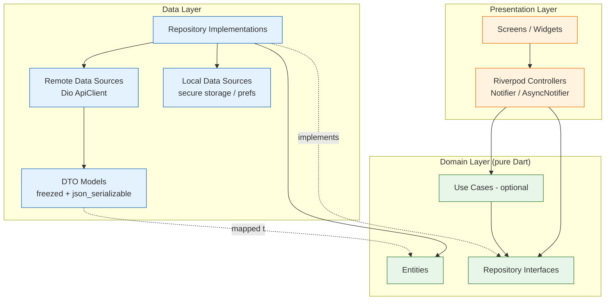
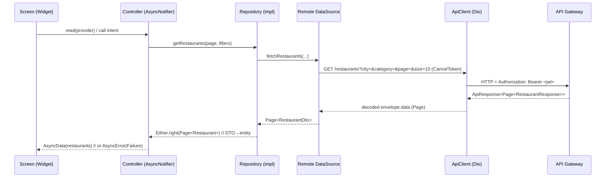
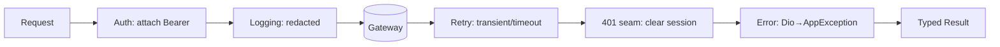
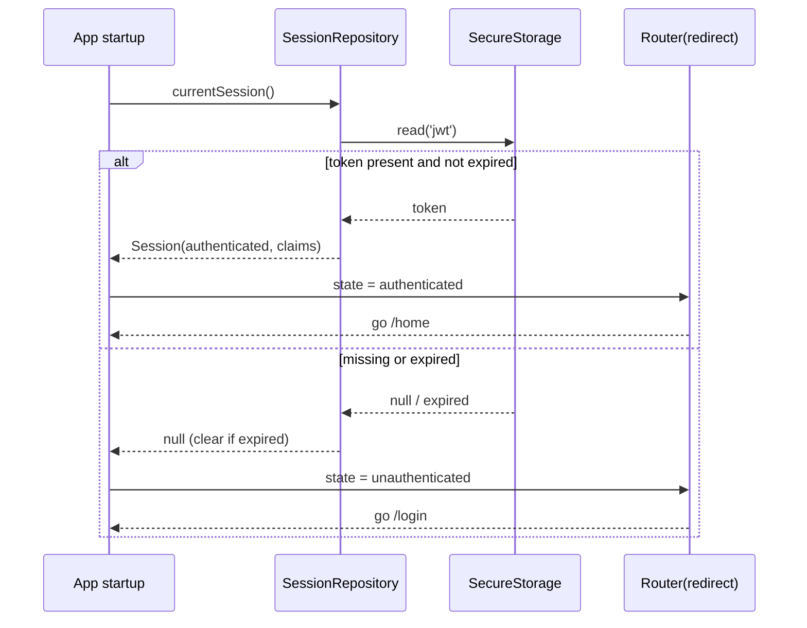
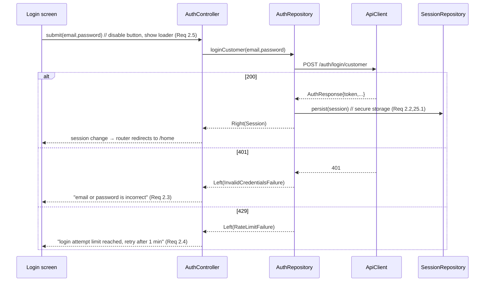
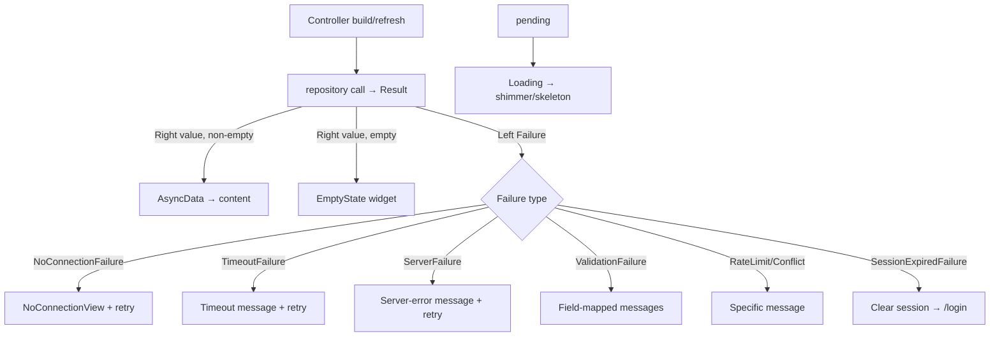

# Design Document — Customer App

## Overview

The Customer App is the customer-facing Flutter client of the existing Food Delivery Platform. It talks to a fixed set of Spring Boot microservices through a single Spring Cloud Gateway base URL. The gateway enforces JWT authentication on every route except `/auth/**` and injects identity headers (`X-User-*`) downstream, so the client never sends a customer identifier in request bodies.

This document specifies the architecture, layering, networking, data models, state management, routing, theming, per-feature design, and testing strategy needed to satisfy all 29 requirements in `requirements.md`. It is a design document: it describes interfaces, contracts, diagrams, and rationale, with small illustrative snippets only. No application code is produced here.

### Design Goals

- **Contract fidelity.** Every model mirrors a verified backend DTO exactly (field names, nullability, types). Restaurant responses are wrapped in `ApiResponse<T>`; list/search responses are Spring `Page<T>`; orders return a bare `OrderResponse`. (Req 24)
- **Gap isolation.** Capabilities with no backend endpoint (addresses, favorites, notifications, payment, profile edit, forgot-password, live tracking) sit behind repository interfaces whose local/polling implementations can be swapped for server-backed ones without touching screens. (Gaps 1–12)
- **Single auth seam.** Exactly one place attaches the JWT and exactly one place handles HTTP 401, so a future refresh flow drops in without restructuring request code. (Req 3, 4)
- **Testability.** Pure mappers and pure logic (round-trip serialization, order partitioning, cart math, pagination) are isolated from I/O so they can be covered by property-based tests. (Req 24.4)
- **Clean Architecture, feature-first.** Presentation depends on domain; data depends on domain; domain depends on nothing. Features are vertical slices.

### Key Design Decisions (and rationale)

| Decision | Choice | Why |
|---|---|---|
| State management | Riverpod with code generation (`@riverpod`) | Compile-safe DI, `AsyncValue` models loading/error/data as a sealed union, `ref` makes the provider→repository→datasource wiring explicit and mockable. See State Management. |
| Models / serialization | `freezed` + `json_serializable` | Immutable value types with `==`, `copyWith`, exhaustive unions, and generated `fromJson`/`toJson`. Value equality is what makes the Req 24.4 round-trip property cheap to assert. |
| Money | `decimal` package (`Decimal`) via a JSON converter | Backend uses `BigDecimal`; Dart `double` loses precision. Storing the wire value into `Decimal` preserves monetary exactness and keeps round-trip equality stable. |
| Temporal fields | Stored as raw `String` on DTOs; parsed in mappers | Jackson date/time wire formats vary by config; keeping the raw string on the DTO guarantees the round-trip property regardless of format, while the domain entity exposes a parsed `DateTime`/`TimeOfDay`. Flagged for integration-time confirmation. |
| Networking | `dio` singleton + ordered interceptor chain | One client, one auth seam, one error-mapping seam, cancellation via `CancelToken`. |
| Result type | `Either<Failure, T>` (sealed) returned by repositories | Forces call sites to handle failure; keeps exceptions at the data boundary. |
| Routing | `go_router` with `redirect` + `refreshListenable` | Declarative auth-guard driven by Riverpod session state; deep-link ready. |
| Image caching | `cached_network_image` | De-facto standard; satisfies Req 26.3 caching. |
| Skeletons | `shimmer` | Standard shimmer placeholders for first-load states (Req 26.2). |
| Connectivity | `connectivity_plus` | Standard offline detection for the no-connection path (Req 23.1). |

> Library choices marked "open" in the brief were resolved to the current de-facto standards used across the Flutter ecosystem. Versions are pinned at implementation time. *Content was rephrased for compliance with licensing restrictions.* References: [Riverpod docs](https://riverpod.dev), [freezed (pub.dev)](https://pub.dev/packages/freezed), [go_router (pub.dev)](https://pub.dev/packages/go_router), [dio (pub.dev)](https://pub.dev/packages/dio).

---

## Architecture

### Clean Architecture layering

The app uses three layers with a strict inward dependency rule. Source code dependencies always point toward the domain; the domain knows nothing about Flutter, Dio, or storage.

- **Presentation** — Widgets/screens and Riverpod controllers (`Notifier`/`AsyncNotifier`). Renders `AsyncValue`/state, dispatches intents to controllers. Depends on domain (entities + repository interfaces) only.
- **Domain** — Pure Dart. Entities, repository *interfaces*, and (where useful) use cases. No imports of Flutter, Dio, freezed-generated DTOs, or storage. The stable core.
- **Data** — DTO models (freezed/json_serializable), data sources (remote via Dio, local via storage), and repository *implementations* that map DTO↔entity and return `Either<Failure, T>`. Depends on domain (to implement its interfaces).



**The dependency rule in practice:** an arrow may cross a layer boundary only when it points toward `Domain`. `REPOIMPL` (data) depends on `REPOI` (domain) by implementing it. `CTRL` (presentation) depends on `REPOI` (domain) by consuming it. The concrete implementation is bound to the interface at the composition root with a Riverpod provider override, so presentation never imports data directly.

**Use cases** are optional. For features with non-trivial orchestration (checkout = address + payment + place order; tracking = poll + cancel) a thin use case clarifies intent. For straightforward pass-through reads (restaurant detail) controllers may call the repository directly. The team applies use cases where they earn their keep rather than universally.

### Request flow (end to end)



---

## State Management

### Riverpod, and why (over Provider / Bloc)

- **Over Provider:** Riverpod removes `BuildContext` coupling, makes providers compile-safe and globally testable, and gives `AsyncValue` for first-class loading/error/data handling. Provider's `ProxyProvider`/`context.read` ergonomics get awkward for the dependency graphs this app needs (session → network → repository → controller).
- **Over Bloc:** For an app dominated by request/response screens with paginated lists and polling, Bloc's event/state ceremony adds boilerplate without proportional benefit. Riverpod's `AsyncNotifier` expresses "load → show → mutate" succinctly, and `ref.watch`/`ref.invalidate` cover invalidation and refresh cleanly. Bloc remains a fine choice generally; for this scope Riverpod is leaner.

`AsyncValue` is a sealed union of loading/error/data, which makes invalid combined states unrepresentable and forces the UI to handle all three branches — exactly the standard pattern for Req 23.5/23.6. *Content was rephrased for compliance with licensing restrictions.* ([AsyncValue overview](https://riverpod.dev)).

### Conventions

- **Code generation on.** Providers are declared with the `@riverpod` annotation and `riverpod_generator`, so the correct provider kind (future/stream/notifier) is inferred and refactors stay type-safe. Rationale: less boilerplate, fewer wrong-provider-kind mistakes, and `ref` is strongly typed. (Pairs with `freezed`/`json_serializable`, which already require `build_runner`.)
- **Controllers.** Screen state lives in a generated `Notifier`/`AsyncNotifier` (the "controller"). Synchronous local state (cart, theme mode) uses `Notifier`; anything that performs I/O uses `AsyncNotifier` and returns `AsyncValue`.
- **Family providers.** Parameterized reads use family providers, e.g. `restaurantMenu(restaurantId)`, `orderTracking(orderId)`, `restaurantById(id)`.
- **Dependency providers.** Infrastructure (Dio `ApiClient`, secure storage, prefs, each repository) is exposed via providers. Repository providers return the *interface* type and are bound to the concrete implementation, so tests override them with fakes/mocks.
- **`autoDispose` by default.** Screen-scoped providers auto-dispose; this is what cancels in-flight requests when a screen is dismissed (Req 23.8). Long-lived state (session, theme, cart) is kept alive.

Skeleton of a controller and its dependency chain:

```dart
@riverpod
class HomeFeed extends _$HomeFeed {
  @override
  Future<RestaurantPage> build() =>
      ref.watch(restaurantRepositoryProvider).getRestaurants(page: 0).getOrThrow();

  Future<void> loadNextPage() async { /* append next page, guard concurrency */ }
}

// data binding at the composition root
@riverpod
RestaurantRepository restaurantRepository(Ref ref) =>
    RestaurantRepositoryImpl(ref.watch(restaurantRemoteDataSourceProvider));
```

A screen consumes the provider, never the repository or data source directly:

```dart
final feed = ref.watch(homeFeedProvider); // AsyncValue<RestaurantPage>
return feed.when(
  loading: () => const RestaurantListSkeleton(),
  error: (e, _) => ErrorState(failure: e as Failure, onRetry: () => ref.invalidate(homeFeedProvider)),
  data: (page) => RestaurantList(page: page),
);
```

---

## Folder Structure

Feature-first under `lib/`, with a shared `core/` for cross-cutting infrastructure. Each feature is a vertical slice split into `data/`, `domain/`, `presentation/`.

```text
lib/
├── main.dart                      # bootstrap: ProviderScope, theme, router
├── app.dart                       # MaterialApp.router wiring (theme + GoRouter)
├── core/
│   ├── network/
│   │   ├── api_client.dart         # generic Dio wrapper (get/post/patch + decoders)
│   │   ├── dio_provider.dart       # Dio instance + interceptor registration
│   │   ├── interceptors/
│   │   │   ├── auth_interceptor.dart       # attaches Bearer token (Req 3.3, 25.3)
│   │   │   ├── error_interceptor.dart      # DioException → AppException (Req 23)
│   │   │   ├── unauthorized_interceptor.dart # single 401 seam (Req 4)
│   │   │   ├── retry_interceptor.dart      # backoff for transient/timeout
│   │   │   └── logging_interceptor.dart    # redacts token/password (Req 25.2)
│   │   ├── api_response.dart        # ApiResponse<T> envelope decoder (Req 24.1/24.2)
│   │   └── page_response.dart       # Spring Page<T> decoder (Req 24.3)
│   ├── error/
│   │   ├── app_exception.dart       # sealed transport/domain exceptions
│   │   ├── failure.dart             # sealed Failure (UI-facing)
│   │   └── result.dart              # Either<Failure,T> typedef + helpers
│   ├── storage/
│   │   ├── secure_storage.dart      # flutter_secure_storage wrapper (token)
│   │   └── preferences.dart         # SharedPreferences wrapper (theme, etc.)
│   ├── routing/
│   │   ├── app_router.dart          # GoRouter table + redirect guard
│   │   └── routes.dart              # route name/path constants
│   ├── theme/
│   │   ├── app_tokens.dart          # color/typography/spacing/radius tokens
│   │   ├── app_theme.dart           # ThemeData light/dark from tokens
│   │   └── theme_extensions.dart    # custom ThemeExtension for app tokens
│   ├── constants/                   # base URL, page size, timeouts, durations
│   ├── utils/                       # debouncer, formatters (intl), jwt_decoder
│   ├── validation/                  # email/password/phone validators (Req 1)
│   ├── extensions/                  # BuildContext, num, DateTime helpers
│   └── widgets/                     # shared widget catalog (see below)
├── features/
│   ├── authentication/
│   │   ├── data/        # dtos (auth_response, user_response), datasource, repo impl
│   │   ├── domain/      # entities (session, identity_claims), repo interfaces
│   │   └── presentation/# login, register, forgot_password(flagged) + controllers
│   ├── home/            # discovery: home, search, filters
│   ├── restaurant/      # detail + menu browsing
│   ├── cart/            # local cart + display pricing
│   ├── checkout/        # address select + payment step + place order
│   ├── orders/          # active/previous history
│   ├── tracking/        # status lifecycle + cancel (stream repo)
│   ├── profile/         # identity display (edit flagged)
│   ├── addresses/       # local address book
│   ├── favorites/       # local favorites
│   ├── notifications/   # push receipt + local store
│   └── settings/        # theme selection
└── bootstrap/
    └── app_startup.dart  # session bootstrap provider (Req 3.1/3.2/3.5)
```

Feature modules (12): **authentication, home (discovery), restaurant, cart, checkout, orders, tracking, profile, addresses, favorites, notifications, settings.**

---

## Components and Interfaces

### Networking layer

**Single base URL.** All traffic goes through the gateway base URL from `core/constants` (HTTPS in non-local builds — Req 25.3). One `Dio` instance is created in `dio_provider.dart` with `BaseOptions(connectTimeout: 15s, receiveTimeout: 15s, sendTimeout: 15s)` (Req 23.2).

**Interceptor chain (ordered).** Order matters; the chain is registered as:

1. **AuthInterceptor** — if the request path is not under `/auth/`, attach `Authorization: Bearer <token>` from secure storage. Auth endpoints are skipped, mirroring the gateway's own rule. (Req 3.3, 25.3)
2. **LoggingInterceptor** — structured request/response logs with token and password fields redacted. (Req 25.2)
3. **RetryInterceptor** — retries idempotent GETs on timeout / transient network errors with bounded exponential backoff; never retries 4xx. (Req 23.2/23.3)
4. **UnauthorizedInterceptor** — the **single 401 seam**, applied only to non-`/auth/**` (authenticated) requests. Implemented as a `QueuedInterceptor` so concurrent 401s are serialized and a future token-refresh runs once. Current behavior: clear session and emit a session-expired signal. (Req 4.1/4.3)
5. **ErrorInterceptor** — converts any `DioException` into a typed `AppException` so upper layers never see Dio types. (Req 23)



**Generic ApiClient.** A thin wrapper exposing typed helpers that hide envelope/pagination decoding from data sources:

```dart
abstract interface class ApiClient {
  // Restaurant service: unwraps ApiResponse<T>.data; throws ApiEnvelopeException if success == false
  Future<T> getEnvelope<T>(String path, {Map<String,dynamic>? query, CancelToken? cancel,
      required T Function(Object? json) decode});
  // Restaurant list/search: unwraps ApiResponse<Page<T>> into a typed PageResult<T>
  Future<PageResult<T>> getEnvelopePage<T>(String path, {Map<String,dynamic>? query,
      CancelToken? cancel, required T Function(Object? json) decodeItem});
  // Order service: bare body (no envelope)
  Future<T> getJson<T>(String path, {Map<String,dynamic>? query, CancelToken? cancel,
      required T Function(Object? json) decode});
  Future<T> postJson<T>(String path, {Object? body, CancelToken? cancel,
      required T Function(Object? json) decode});
  Future<T> patchJson<T>(String path, {Object? body, CancelToken? cancel,
      required T Function(Object? json) decode});
}
```

**Generic envelope + pagination decoding.**

- `ApiResponse<T>` decoder reads `{success, message, data}`. If `success == false`, it raises an `ApiEnvelopeException(message)` that the error layer maps to a `ServerFailure` carrying the envelope message (Req 24.1/24.2).
- Spring `Page<T>` decoder reads `content[]` plus pagination metadata (`number`, `size`, `totalElements`, `totalPages`, `last`, `first`) into a generic `PageResult<T>` so screens can drive infinite scroll off `last`/`number`. (Req 24.3, 7.3, 8.3)

**Cancellation.** Every remote call accepts a `CancelToken`. Screen-scoped controllers create a token in `build()` and cancel it in `ref.onDispose`, satisfying both search-supersede (Req 8.2) and dismiss-cancellation (Req 23.8). The search controller additionally cancels the prior token when a new keyword supersedes an in-flight request.

**Typed error model.** Two sealed hierarchies keep transport concerns out of the UI:

```dart
// data boundary (thrown inside data layer)
sealed class AppException implements Exception {}
class NoConnectionException     extends AppException {}
class TimeoutException          extends AppException {}
class UnauthorizedException     extends AppException {}            // 401
class ServerException           extends AppException { final int status; final String? message; }   // 5xx
class ClientException           extends AppException { final int status; final String? message; final Map<String,String>? fieldErrors; } // 4xx != 401
class ApiEnvelopeException      extends AppException { final String message; } // success == false
class UnknownException          extends AppException {}

// UI-facing (returned by repositories inside Either)
sealed class Failure { final String message; }
class NoConnectionFailure extends Failure {}
class TimeoutFailure      extends Failure {}
class ServerFailure       extends Failure {}            // 5xx + envelope-false
class ValidationFailure   extends Failure { final Map<String,String> fieldErrors; } // 400 w/ field errors
class ConflictFailure     extends Failure {}            // 409 (duplicate account)
class RateLimitFailure    extends Failure {}            // 429
class InvalidCredentialsFailure extends Failure {}      // 401 from /auth/** (bad email/password)
class SessionExpiredFailure extends Failure {}          // 401 from an authenticated route (after seam clears)
class UnknownFailure      extends Failure {}
```

**401 has two meanings, scoped by path.** A 401 from an `/auth/**` endpoint means invalid credentials (Req 2.3) and maps to `InvalidCredentialsFailure`; there is no session to clear. A 401 from any other (authenticated) route means the session is no longer valid and maps to `SessionExpiredFailure`. The interceptor below applies the session-clear behavior only to non-`/auth/**` paths, so a failed login never triggers session-expiry handling.

**Result type.** Repositories return `Either<Failure, T>` (typedef `Result<T>`). Controllers convert a left `Failure` into `AsyncError` and a right value into `AsyncData`. This makes the error path explicit and testable. (Used by every feature; supports Req 23.)

**401 seam + refresh-ready design.** The `UnauthorizedInterceptor` is the only component that reacts to 401, and it acts **only on non-`/auth/**` (authenticated) requests**. Today it clears the token and broadcasts `SessionExpired`; 401s from `/auth/**` pass through as `InvalidCredentialsFailure` for the Auth module to display. To add refresh later, only this interceptor changes: attempt refresh once, retry the queued requests, and clear session solely if refresh fails. No repository or screen changes (Req 4.3, Gap 1).

### Repositories and data sources

Every feature exposes a **domain repository interface**; the **data layer** implements it. Gap features get a local data source now with the same interface a server-backed source will later satisfy. Interface signatures (abridged):

```dart
// authentication/domain
abstract interface class AuthRepository {
  Future<Result<UserAccount>> registerCustomer(RegisterParams p);     // POST /auth/register/customer (Req 1)
  Future<Result<Session>>     loginCustomer(String email, String password); // POST /auth/login/customer (Req 2)
}
abstract interface class SessionRepository {                           // Req 3,4,5,25
  Future<Session?> currentSession();        // reads secure storage + decodes claims
  Future<void>     persist(Session session);
  Future<void>     clear();                 // logout / 401
  Stream<SessionState> changes();           // drives router refreshListenable
  IdentityClaims?  claims();                // decoded JWT (id,email,role,name,phone)
}
abstract interface class PasswordRecoveryRepository {                  // Gap 2 (flagged disabled)
  Future<Result<void>> requestReset(String email);                    // throws FeatureUnavailable now
  Future<Result<void>> verifyOtp(String email, String otp);
}

// home (discovery)
abstract interface class RestaurantRepository {
  Future<Result<PageResult<Restaurant>>> getRestaurants({int page, int size, String? city, String? category}); // Req 7
  Future<Result<PageResult<Restaurant>>> search({required String keyword, int page, int size, CancelToken? cancel}); // Req 8
  Future<Result<Restaurant>> getById(String id);                      // Req 10, 20.3
  Future<Result<Restaurant>> getMenu(String restaurantId);            // GET /restaurants/{id}/menu (Req 10)
}

// cart (local only)
abstract interface class CartRepository {                             // Req 11,12
  Cart current();
  Cart addItem(MenuItem item, String restaurantId);  // replace-cart rule on restaurant change
  Cart changeQuantity(String menuItemId, int delta); // remove at zero
  Cart clear();
  Stream<Cart> watch();
}

// checkout / orders / tracking
abstract interface class PaymentRepository {                          // Gap 3 (swappable for a real gateway)
  Future<Result<PaymentOutcome>> pay(PaymentContext ctx);             // no-op approval today; order auto-confirms server-side via Kafka outbox
}
abstract interface class OrderRepository {
  Future<Result<Order>>        placeOrder(PlaceOrderParams p);        // POST /orders (Req 15)
  Future<Result<List<Order>>>  myOrders();                            // GET /orders/my-orders (Req 16)
  Future<Result<Order>>        getById(String orderId);               // GET /orders/{id} (Req 17.1)
  Future<Result<Order>>        cancel(String orderId);                // PATCH /orders/{id}/cancel (Req 17.6)
}
abstract interface class OrderTrackingRepository {                    // Req 17.5, Gap 10
  Stream<Order> track(String orderId);   // polling impl now (15s); WebSocket impl later
}

// gap-backed local features
abstract interface class AddressRepository {     // Gap 4 (local now)  Req 13,19
  Future<List<DeliveryAddress>> all();
  Future<void> save(DeliveryAddress a);
  Future<void> delete(String id);
  Future<void> setDefault(String id);
  Future<DeliveryAddress?> defaultAddress();
}
abstract interface class FavoritesRepository {   // Gap 5 (local now)  Req 20
  Future<Set<String>> ids();
  Future<void> add(String restaurantId);
  Future<void> remove(String restaurantId);
  Stream<Set<String>> watch();
}
abstract interface class NotificationRepository {// Gap 6 (local now)  Req 21
  Future<List<AppNotification>> history();        // reverse chronological
  Future<void> store(AppNotification n);
  Stream<List<AppNotification>> watch();
}
abstract interface class ProfileRepository {     // Gap 7 (claims now)  Req 18
  Future<Result<CustomerProfile>> get();          // from IdentityClaims today
  Future<Result<CustomerProfile>> update(ProfileEdit e); // throws FeatureUnavailable now
}
abstract interface class SettingsRepository {    // Req 22
  ThemeMode themeMode();
  Future<void> setThemeMode(ThemeMode mode);
}
```

**Swappable seams (Gap strategy).** Each gap feature has one interface and (today) one local/polling implementation. The composition-root provider decides which implementation binds. Replacing local-with-server or polling-with-WebSocket is a single provider edit; screens depend only on the interface. (Gaps 1–12)

**Stream-based tracking.** `OrderTrackingRepository.track(orderId)` returns a `Stream<Order>`. The current `PollingOrderTrackingRepository` emits an immediate value, then re-fetches `GET /orders/{orderId}` every 15s, and **completes the stream** once a terminal status (`DELIVERED`/`CANCELLED`/`FAILED`) is observed (Req 17.3/17.4). A future `WebSocketOrderTrackingRepository` implements the same signature; the tracking screen is unchanged (Req 17.5, Gap 10).

### Authentication and session flow

**Storage.** The JWT lives only in `flutter_secure_storage` (Req 25.1). No token or password is ever logged (Req 25.2). `SharedPreferences` holds non-sensitive prefs (theme).

**Identity claims.** The login response (`AuthResponse{token,userId,fullName,email,role}`) supplies display fields; additionally the JWT is decoded (`jwt_decoder`) to expose `IdentityClaims{id,email,role,name,phone}` and an `exp` expiry used at startup (Req 3.4/3.5). Profile and order screens read claims rather than calling a profile endpoint (Gap 7).

**App-start bootstrap + route decision** (Req 3.1/3.2/3.5):



**Login** (Req 2):



**Authenticated request + 401-driven clear** (Req 4): any non-auth request passes through `AuthInterceptor` (attach token). On 401, the `UnauthorizedInterceptor` clears the token via `SessionRepository.clear()` and pushes `SessionExpired` on the session stream; the router's `refreshListenable` fires and redirects to `/login`, and the Auth module shows a session-ended message (Req 4.1/4.2). **Logout** (Req 5) calls the same `clear()`, then the redirect removes authenticated routes from history.

### Routing

`go_router` with a single `redirect` guard reading session state from Riverpod, and a `refreshListenable` bridged from `SessionRepository.changes()` so login/logout/expiry re-evaluate routes immediately. ([GoRouter + Riverpod redirect pattern](https://riverpod.dev) — *rephrased for compliance*.)

Route table:

| Path | Screen | Guard |
|---|---|---|
| `/splash` | startup/bootstrap | public; decides initial redirect |
| `/login` | Login | public (redirect to `/home` if authed) |
| `/register` | Register | public |
| `/forgot-password` | Forgot password (flagged disabled) | public (Req 6) |
| `/home` | Home / discovery | protected |
| `/search` | Search | protected |
| `/restaurant/:id` | Restaurant detail + menu | protected |
| `/cart` | Cart | protected |
| `/checkout` | Checkout (address → payment → place) | protected |
| `/orders` | Order history (active/previous) | protected |
| `/tracking/:orderId` | Order tracking | protected (deep-link target from notifications, Req 21.3) |
| `/profile` | Profile | protected |
| `/addresses` | Address book | protected |
| `/favorites` | Favorites | protected |
| `/notifications` | Notifications | protected |
| `/settings` | Settings | protected |

**Guard logic.** `redirect` returns `/login` for a protected route when unauthenticated, `/home` for `/login`|`/register` when already authenticated, and `null` otherwise. Protected routes are grouped under a `ShellRoute` carrying the bottom navigation (Home, Orders, Favorites, Profile). Deep links (e.g. `/tracking/:orderId`) are honored after the guard resolves, enabling notification-tap navigation (Req 21.3) and future external deep links.

### Theming and design system

**Tokens (`core/theme/app_tokens.dart`).** Centralized primitives consumed by both themes and exposed to widgets through a `ThemeExtension` so custom tokens (e.g. status colors, spacing) are available via `Theme.of(context)`:

- **Color** — brand seed + semantic roles (primary, surface, error, success, warning) and order-status palette (one color per `OrderStatus`).
- **Typography** — a `TextTheme` scale (display/headline/title/body/label) using scalable units so OS text scaling applies (Req 28.2).
- **Spacing** — 4-pt scale (`xs=4, sm=8, md=16, lg=24, xl=32`).
- **Radius** — `sm=8, md=12, lg=16, pill=999`.
- **Elevation** — `level0..level3`.

```dart
@immutable
class AppTokens extends ThemeExtension<AppTokens> {
  final Color statusPreparing, statusOutForDelivery, statusDelivered, statusFailed; // ...
  final double spaceXs, spaceSm, spaceMd, spaceLg, spaceXl;
  final double radiusSm, radiusMd, radiusLg;
  // copyWith + lerp ...
}
```

**Material 3 themes (`app_theme.dart`).** `ThemeData(useMaterial3: true, colorScheme: ColorScheme.fromSeed(seedColor, brightness))` for light and dark, both derived from the same tokens; the `AppTokens` extension is attached to each. Switching theme mode re-applies tokens app-wide without restart (Req 29.3, 22.3).

**Accessibility (Req 28).** Tokens are chosen so body text meets ≥4.5:1 contrast in both themes; interactive controls are sized to ≥48×48 logical px (enforced via shared button/icon-button widgets with minimum constraints); every interactive control and informational image carries a semantic label; text uses scalable units that honor the OS text-scale.

### Reusable widget catalog (`core/widgets/`)

| Widget | Responsibility |
|---|---|
| `PrimaryButton` / `SecondaryButton` | Standard buttons with loading state and ≥48px hit target (Req 2.5, 28.4) |
| `AppTextField` | Labeled field with inline validation + error text (Req 1.3) |
| `AppCard` | Token-styled container surface |
| `RestaurantCard` | Name, cuisine, rating, avg delivery time, open/closed badge + favorite toggle (Req 7.2, 20) |
| `MenuItemTile` | Name, description, price, veg indicator, availability disabled-state, quantity stepper (Req 10.2/10.4, 11) |
| `OrderCard` | Order summary + status chip; tap routes to tracking (Req 16) |
| `OrderStatusChip` | Colored chip per `OrderStatus` from tokens (Req 17.2) |
| `OrderStatusTimeline` | Vertical stepper rendering all 9 statuses incl. terminal CANCELLED/FAILED branch (Req 17.2) |
| `QuantityStepper` | +/- control bound to `CartRepository` (Req 11.3/11.4) |
| `RatingView` | Read-only star/numeric rating (Req 10.3) |
| `AppSearchBar` | Debounced search input (Req 8.1) |
| `SkeletonList` / `Shimmer*` | Shimmer placeholders for first load (Req 26.2) |
| `EmptyState` | Distinct empty UI with optional CTA (Req 7.6, 8.4, 12.5, 16.5, 23.6) |
| `ErrorStateView` | Maps `Failure` → message + retry control (Req 23.1/23.3/23.7) |
| `NoConnectionView` | Offline message + retry (Req 23.1) |
| `AppBottomSheet` / `AppDialog` | Confirm dialogs (replace-cart, logout, cancel order) (Req 11.2, 5, 17.6) |
| `AppSnackbar` | Transient messages (success/error) (Req 1.2) |
| `AdaptiveListGrid` | 1-column vs multi-column by breakpoint (Req 27.1/27.2) |

### Per-feature design

For each feature: screens, controller(s), data flow, and the requirements/endpoints fulfilled.

- **Authentication** — Screens: Login, Register, Forgot-password (flagged disabled). Controllers: `AuthController` (`AsyncNotifier`) for register/login; reads `AuthRepository`, writes `SessionRepository`. Validation via `core/validation` (email; password 8–25 register / 8–15 login; phone `^[6-9]\d{9}$`). Maps 201→success+route-to-login (Req 1.2), 409→duplicate (1.4), 429→rate-limit (1.5/2.4), 400→field errors (1.6/6). Forgot-password sits behind `PasswordRecoveryRepository` and renders "coming soon" (Req 6, Gap 2). Endpoints: `POST /auth/register/customer`, `POST /auth/login/customer`.
- **Home / Discovery** — Screens: Home (recommended + promotions + paginated list), Search. Controllers: `HomeFeed` (`AsyncNotifier`, infinite scroll, size 10), `RestaurantSearch` (debounced 400ms, supersede-cancel), `DiscoveryFilters` (`Notifier`, city/category). Recommended = client-side sort by rating desc; promotions = curated client content; filter-chip catalog derived from loaded data (Gaps 9, 11). Endpoints: `GET /restaurants`, `GET /restaurants/search`. (Req 7, 8, 9, 26)
- **Restaurant** — Screen: Restaurant detail + menu grouped by category with in-menu text filter. Controller: `restaurantMenu(id)` family `AsyncNotifier`. Disables unavailable items and read-only rating. Endpoint: `GET /restaurants/{restaurantId}/menu` (and `GET /restaurants/{id}`). (Req 10)
- **Cart** — Screen: Cart review with display-only pricing (subtotal/fee/tax/total labeled indicative) and coupon input (no server effect). Controller: `CartController` (`Notifier`, kept-alive) over `CartRepository`. Enforces single-restaurant cart with replace confirmation; quantity-to-zero removes; empty state disables checkout. (Req 11, 12, Gap 12)
- **Checkout** — Screens: Address selection, Payment step, Confirm/Place. Controller: `CheckoutController` orchestrating `AddressRepository` + `PaymentRepository` + `OrderRepository`. Builds the `POST /orders` body from cart + selected `Delivery_Location`; excludes any customer id (Req 15.2). On 201: clears cart, routes to `/tracking/:orderId`, shows server pricing as authoritative (Req 15.3/15.4). Payment step places the order and relies on automatic server-side confirmation: the order is created in `PENDING_PAYMENT` and the backend's Kafka outbox choreography auto-confirms it to `CONFIRMED` (simulated approval, no real gateway), which the app observes by polling order status until it leaves `PENDING_PAYMENT` (or `FAILED` on failure). No client payment endpoint is called; `PaymentRepository` stays swappable for a future real gateway (Req 14, Gap 3). Endpoint: `POST /orders`.
- **Orders** — Screen: history with Active vs Previous sections. Controller: `MyOrders` (`AsyncNotifier`) over `OrderRepository.myOrders()`; partitions client-side by terminal status. Endpoint: `GET /orders/my-orders`. (Req 16)
- **Tracking** — Screen: status timeline (all 9 states) + cancel control for cancellable states. Controller: `OrderTracking(orderId)` consuming `OrderTrackingRepository.track()` (polling 15s, stops at terminal) and `OrderRepository.cancel()`. Endpoints: `GET /orders/{orderId}`, `PATCH /orders/{orderId}/cancel`. (Req 17, Gap 10)
- **Profile** — Screen: identity display (name/email/phone/role from claims); edit controls disabled. Controller: `ProfileController` over `ProfileRepository` (claims-backed today). (Req 18, Gap 7)
- **Addresses** — Screen: list/add/delete/set-default. Controller: `AddressController` over local `AddressRepository`. Feeds checkout selection. (Req 13, 19, Gap 4)
- **Favorites** — Screen: favorites grid resolving ids → `GET /restaurants/{id}`. Controller: `FavoritesController` over local `FavoritesRepository`. (Req 20, Gap 5)
- **Notifications** — Screen: reverse-chronological local list; tapping an order notification deep-links to tracking. Controller: `NotificationsController` over local `NotificationRepository`; push receipt writes to the store. (Req 21, Gap 6)
- **Settings** — Screen: theme mode (light/dark/system). Controller: `SettingsController`/`ThemeModeController` over `SettingsRepository` (prefs). Applies theme app-wide live. (Req 22, 29)

### Real-time readiness

Two features are designed around a **stream repository** so transport can change without screen changes:

- **Tracking** (Req 17.5, Gap 10): `OrderTrackingRepository.track()` returns `Stream<Order>`. Polling today; a WebSocket implementation later emits on push. The tracking controller only consumes the stream.
- **Notifications** (Req 21, Gap 6): `NotificationRepository.watch()` returns `Stream<List<AppNotification>>` fed by push + local store today; a server history/stream later replaces the source. The screen only consumes the stream.

This satisfies the requirement that polling/local implementations be swappable for a real-time transport without restructuring consuming screens.

---

## Data Models

Each backend DTO has a 1:1 **DTO model** (data layer, freezed + json_serializable) and a **domain entity** (pure Dart). DTOs preserve the wire shape exactly (for the round-trip property); mappers translate DTO↔entity. Nullability mirrors the Java types: capital wrapper types (`Boolean`, `Integer`, `Double`, `BigDecimal`) and object types are nullable; primitive `boolean` is non-null.

### Serialization approach

- **`freezed` + `json_serializable`** generate `fromJson`/`toJson`, `==`, `hashCode`, and `copyWith`. Value equality is what makes the Req 24.4 round-trip property assertable as `dto == Dto.fromJson(dto.toJson())`.
- **Money** (`BigDecimal` fields: `price`, `subtotal`, `deliveryFee`, `tax`, `totalAmount`, `totalPrice`) maps to `Decimal` (`decimal` package) via a `DecimalJsonConverter` that reads from number-or-string and writes a canonical string. Rationale: `double` cannot represent decimal money exactly; `Decimal` round-trips and compares exactly.
- **Temporal** (`openingTime`/`closingTime` = `LocalTime`; `createdAt`/`updatedAt` = `LocalDateTime`; order `createdAt` = `OffsetDateTime`) is stored as the **raw `String`** on the DTO to keep round-trip independent of Jackson's wire format; the mapper parses to `TimeOfDay`/`DateTime` on the entity. The exact wire format is confirmed at integration (flagged risk).
- **IDs** are modeled as `String` on the client (restaurant ids are already `String`; order/customer UUIDs serialize as strings). When building `POST /orders`, `restaurantId` is sent as the string the backend parses to `UUID`.
- **Enums**: `OrderStatus` maps to a Dart enum with a tolerant decoder that routes any unrecognized value to a safe `unknown` sentinel (kept out of partition logic) so an added backend status cannot crash decoding.

### DTO ↔ entity catalog

| Backend DTO (Java) | Client DTO (data) | Domain entity | Field notes / nullability |
|---|---|---|---|
| `AuthResponse{token,userId,fullName,email,role}` | `AuthResponseDto` | `Session{token, claims}` | all present on 200; `role` enum→string |
| `UserResponse{id,fullName,email,phone,role}` | `UserResponseDto` | `UserAccount` | registration result (Req 1) |
| `RestaurantResponse` | `RestaurantDto` | `Restaurant` | `id` String; `open` `bool?`; `averageDeliveryTime` `int?`; `rating` `double?`; `imageUrl/logoUrl/coverImageUrl/cuisine/description/address/city` `String?`; `active` `bool` (non-null); `openingTime/closingTime` `String?`(raw)→`TimeOfDay?`; `createdAt/updatedAt` `String?`(raw)→`DateTime?`; `categories` `List<CategoryDto>?`→ defaults to `[]` (null on list endpoint, populated on menu endpoint) |
| `CategoryResponse{id,name,items}` | `CategoryDto` | `MenuCategory` | `items` `List<MenuItemDto>?`→`[]` |
| `MenuItemResponse{id,name,description,price,available,vegetarian,imageUrl}` | `MenuItemDto` | `MenuItem` | `price` `Decimal`; `available`/`vegetarian` `bool?`→default `false`/`false` with explicit handling; `description/imageUrl` `String?` |
| `Page<RestaurantResponse>` | `PageDto<T>` | `PageResult<Restaurant>` | `content[]`, `number`, `size`, `totalElements`, `totalPages`, `last`, `first` (Req 24.3) |
| `ApiResponse<T>{success,message,data}` | `ApiResponseDto<T>` | (unwrapped) | `success` drives error mapping (Req 24.1/24.2) |
| `CreateOrderRequest{restaurantId,deliveryLocation,deliveryAddress,items[]}` | `CreateOrderDto` | `PlaceOrderParams` | request-only; **no customerId** (Req 15.2) |
| `CreateOrderItemRequest{menuItemId,itemName,quantity}` | `CreateOrderItemDto` | `CartLine`→item | `quantity` ≥ 1 |
| `DeliveryLocationRequest/Response{address,latitude,longitude}` | `DeliveryLocationDto` | `DeliveryLocation` | `latitude/longitude` `double` (request non-null) |
| `OrderResponse` | `OrderDto` | `Order` | ids `String`; money `Decimal`; `status` `OrderStatus`; `items` list; `createdAt` `String`(raw)→`DateTime` |
| `OrderItemResponse{id,menuItemId,itemName,price,quantity,totalPrice}` | `OrderItemDto` | `OrderItem` | money `Decimal`; `quantity` `int` |

### Client-only models (gap features)

| Model | Storage | Notes |
|---|---|---|
| `DeliveryAddress{id,label,address,latitude,longitude,isDefault}` | local (Gap 4) | feeds checkout `Delivery_Location` (Req 13, 19) |
| `FavoriteRef{restaurantId,addedAt}` | local (Gap 5) | resolved via `GET /restaurants/{id}` (Req 20) |
| `AppNotification{id,title,body,orderId?,receivedAt,read}` | local (Gap 6) | reverse-chronological; `orderId` enables deep link (Req 21) |
| `Cart{restaurantId?, lines:[{menuItemId,itemName,unitPrice:Decimal,quantity}]}` | in-memory/local (Req 11,12) | single-restaurant invariant; display pricing only |
| `IdentityClaims{id,email,role,name,phone,exp}` | derived from JWT | profile + order display (Req 3.4, 18) |
| `AppSettings{themeMode}` | prefs (Req 22) | default `system` |

---

## Correctness Properties

*A property is a characteristic or behavior that should hold true across all valid executions of a system — essentially, a formal statement about what the system should do. Properties serve as the bridge between human-readable specifications and machine-verifiable correctness guarantees.*

The properties below were derived from the acceptance-criteria prework. Criteria that are specific scenarios, boundary cases, configuration/setup checks, or architectural seams are covered by example, edge-case, and smoke tests in the Testing Strategy rather than by properties. Each property is universally quantified and traces to the requirements it validates.

### Property 1: Serialization round-trip

*For any* valid restaurant, category, menu item, page, order, order item, or delivery-location model, decoding a payload into the model and then encoding it back SHALL produce a value equal to the original model for all round-tripped fields (i.e. `fromJson(toJson(model)) == model`), with money preserved exactly via `Decimal` and temporal fields preserved as their raw wire string.

**Validates: Requirements 24.1, 24.3, 24.4**

### Property 2: Registration and login input validation gating

*For any* set of registration field values, the form SHALL be submittable if and only if the email is well-formed, the password length is within 8–25, the full name is non-blank (not whitespace-only), and the phone matches `^[6-9]\d{9}$`; and *for any* login field values, submission SHALL be allowed if and only if the email is well-formed and the password length is within 8–15.

**Validates: Requirements 1.1, 1.3, 2.1**

### Property 3: Failure classification mapping

*For any* transport outcome (no-connectivity error, timeout, HTTP 5xx, HTTP 4xx other than 401, HTTP 409, HTTP 429, or an `ApiResponse` envelope with `success == false`), the error mapper SHALL produce exactly one corresponding `Failure` (`NoConnectionFailure`, `TimeoutFailure`, `ServerFailure`, `ValidationFailure` with the server field-error map preserved, `ConflictFailure`, `RateLimitFailure`, or `ServerFailure` carrying the envelope message), and SHALL never lose a server-provided field-error entry.

**Validates: Requirements 1.6, 23.1, 23.2, 23.3, 23.4, 24.2**

### Property 4: Authorization header attachment

*For any* request path, the auth interceptor SHALL attach an `Authorization: Bearer <token>` header if and only if the path is not under `/auth/`, and SHALL never attach it to `/auth/**` requests.

**Validates: Requirements 3.3, 25.3**

### Property 5: Identity-claims decode round-trip

*For any* identity-claim set (id, email, role, name, phone, expiry), encoding it into a JWT payload and decoding it back SHALL yield an equal claim set.

**Validates: Requirements 3.4**

### Property 6: Startup session route decision

*For any* combination of (stored-token-present, token-expired), the startup decision SHALL resolve to the home route if and only if a token is present and not expired, and to the login route otherwise.

**Validates: Requirements 3.1, 3.2, 3.5**

### Property 7: Discovery filter query-parameter inclusion

*For any* combination of city and category filter states, the restaurant-list request SHALL include the `city` query parameter if and only if a city filter is set, and the `category` query parameter if and only if a category filter is set.

**Validates: Requirements 7.4, 7.5**

### Property 8: Pagination accumulation and prefetch

*For any* sequence of paginated responses, the accumulated list SHALL equal the in-order concatenation of the pages' contents, page advancement SHALL stop when the `last` flag is true, and *for any* (visible index, list length, last-flag) the next-page prefetch SHALL trigger if and only if the visible index is within three of the end and `last` is false.

**Validates: Requirements 7.3, 8.3, 26.1, 26.4**

### Property 9: Recommended ordering by rating

*For any* list of restaurants, the recommended section SHALL be a permutation of the input ordered by rating in descending order (with a defined, stable placement for missing ratings).

**Validates: Requirements 9.1**

### Property 10: In-menu search filtering

*For any* menu and any search text, the filtered menu items SHALL be exactly those whose name or description contains the search text (case-insensitive): every matching item is retained and every non-matching item is excluded.

**Validates: Requirements 10.5**

### Property 11: Menu category grouping preserves items

*For any* restaurant menu, flattening the category-grouped items SHALL yield the same multiset of items as the source item collection — no item is lost, duplicated, or reassigned to a foreign category.

**Validates: Requirements 10.2**

### Property 12: Cart math and state transitions

*For any* cart and any available menu item, adding the item SHALL store its menu-item id, name, and a quantity of at least one; changing quantity SHALL update the stored quantity; decreasing quantity to zero SHALL remove the item; each line total SHALL equal unit price times quantity; the subtotal SHALL equal the sum of line totals (computed with `Decimal`); and adding an item whose availability flag is false SHALL leave the cart unchanged.

**Validates: Requirements 10.4, 11.1, 11.3, 11.4, 12.1, 12.2**

### Property 13: Cart single-restaurant invariant

*For any* sequence of add operations, all items in the cart SHALL share a single restaurant id at all times, and confirming the replace prompt when adding an item from a different restaurant SHALL result in a cart containing only the new restaurant's item(s).

**Validates: Requirements 11.2**

### Property 14: Checkout placement gating

*For any* combination of cart contents and address selection, the control that proceeds to checkout / places the order SHALL be enabled if and only if the cart is non-empty and a delivery address is selected.

**Validates: Requirements 12.4, 12.5, 13.3**

### Property 15: Order request body construction excludes customer identity

*For any* non-empty cart and selected delivery address, the `POST /orders` request body SHALL contain the restaurant id, the delivery location (`address`, `latitude`, `longitude`) and delivery-address text from the selected address, and an items list mapping each cart line to (`menuItemId`, `itemName`, `quantity`) — and SHALL contain no customer-identifier field.

**Validates: Requirements 13.2, 15.1, 15.2**

### Property 16: Order status interpretation

*For any* order status value, the status interpretation SHALL satisfy all of: (a) the order is classified as Active if and only if its status is not `DELIVERED`, `CANCELLED`, or `FAILED`, and as Previous otherwise, with the two classes partitioning every order exactly once; (b) the lifecycle view maps every one of the nine status values to a defined representation (the mapping is total); and (c) the cancel control is presented if and only if the status is in the customer-cancellable set.

**Validates: Requirements 16.2, 16.3, 17.2, 17.6**

### Property 17: Tracking stream stops at terminal status

*For any* sequence of order statuses delivered through the tracking stream, the stream SHALL emit updates until the first terminal status (`DELIVERED`, `CANCELLED`, or `FAILED`) is observed and SHALL stop/complete exactly at that point — not before a terminal status and not after.

**Validates: Requirements 17.4**

### Property 18: Address store round-trip, deletion, and single default

*For any* sequence of address operations, reading back the store SHALL return exactly the set of saved addresses (round-trip); deleting an address SHALL remove only that address and retain the others; and after designating any saved address as default, exactly one address SHALL be marked default.

**Validates: Requirements 13.4, 19.1, 19.2, 19.3, 19.4**

### Property 19: Favorites set add idempotence and removal

*For any* sequence of favorite operations, adding a restaurant id SHALL make it present, adding the same id again SHALL leave the set unchanged (idempotence), and removing an id SHALL make it absent; reading back SHALL return exactly the resulting id set.

**Validates: Requirements 20.1, 20.2**

### Property 20: Notifications reverse-chronological ordering

*For any* set of stored notifications, the displayed list SHALL be a permutation of the stored notifications ordered by received-time in descending order.

**Validates: Requirements 21.2**

### Property 21: Theme preference round-trip and default

*For any* selected theme mode, persisting then reading the preference SHALL return the same mode; and *for any* stored-preference state, the resolved startup theme SHALL be the stored mode when present and the system theme when absent.

**Validates: Requirements 22.1, 22.2**

### Property 22: Sensitive value redaction in logs

*For any* log record whose request or response embeds a JWT or a password value, the logged output SHALL NOT contain that token or password value.

**Validates: Requirements 25.2**

### Property 23: Responsive column selection

*For any* screen width, the number of list columns SHALL be one when the width is below the tablet breakpoint and greater than one when the width is at or above it, and the column-count function SHALL be non-decreasing in width.

**Validates: Requirements 27.1, 27.2**

### Property 24: Body-text contrast ratio

*For any* body-text foreground/background role pair drawn from the design tokens, in both the light and dark themes, the computed WCAG contrast ratio SHALL be at least 4.5 to 1.

**Validates: Requirements 28.3**

---

## Error Handling

### Standard state pattern

Every data-driven screen renders an `AsyncValue<T>` (or a `Result<T>` lifted into one) through a single shared decision:



- **Empty vs error are distinct** (Req 23.6): an empty but successful result renders `EmptyState`, never `ErrorStateView`.
- **Loading** always shows shimmer/skeleton placeholders on first load (Req 23.5, 26.2).
- **Retry** (Req 23.7) re-invokes the same provider via `ref.invalidate`, reissuing the request.

### Failure mapping (single seam)

The `ErrorInterceptor` converts every `DioException` to an `AppException`; repositories catch `AppException` and return a `Failure` (Property 3). This is the only translation point, so screens deal exclusively with `Failure` subtypes and never with Dio types. The envelope-false case (`ApiResponse.success == false`) is mapped to `ServerFailure(message)` so the server message reaches the UI (Req 24.2).

### Offline detection

`connectivity_plus` provides a connectivity stream surfaced through a provider. The error path distinguishes a genuine no-connection state (`NoConnectionFailure` → `NoConnectionView` with retry) from server/timeout failures (Req 23.1). A global banner can also reflect offline status; per-screen retry remains the primary affordance.

### Timeouts, retries, cancellation

- **Timeout** is 15s for connect/receive/send; exceeding it yields `TimeoutFailure` (Req 23.2).
- **Retry** (transient/timeout, idempotent GET only) uses bounded exponential backoff in the `RetryInterceptor`; it never retries 4xx.
- **Cancellation**: screen-scoped `autoDispose` controllers cancel their `CancelToken` in `ref.onDispose`, cancelling in-flight requests when a screen is dismissed (Req 23.8); the search controller also cancels a superseded request before issuing a new one (Req 8.2).

### Session-expiry path

A 401 is handled only by the `UnauthorizedInterceptor` (Req 4.3): it clears secure storage (Req 4.1, 25.4), emits `SessionExpired` on the session stream (router redirects to `/login`), and the Auth module shows the session-ended message (Req 4.2). The same interceptor is the documented drop-in point for a future refresh flow (Gap 1).

---

## Performance and Rendering

- **Pagination / infinite scroll** (Req 26.1, 26.4): page size 10; the list prefetches the next page when the last visible item is within three of the end and more pages remain (Property 8). Builders use `ListView.builder`/`GridView.builder` for virtualization so only visible items are built.
- **Image caching** (Req 26.3): `cached_network_image` caches remote images (restaurant logo/cover, menu item images) so a previously loaded image is not re-downloaded per render; placeholders use shimmer and a token fallback.
- **Skeletons** (Req 26.2): first-load screens render `shimmer` skeletons matching final layout to reduce perceived latency.
- **Const-correctness**: stateless presentational widgets are `const` where possible; controllers expose immutable freezed state so rebuilds are minimal and `==`-cheap.
- **Selective rebuilds**: screens `ref.watch` narrowly-scoped providers (e.g. `select`) so unrelated state changes do not rebuild large subtrees.

### Responsiveness and layout adaptation (Req 27)

- A `columnsForWidth(width)` pure function returns 1 below the tablet breakpoint and >1 at/above it (Property 23); `AdaptiveListGrid` consumes it for restaurant/menu lists.
- `LayoutBuilder`/`MediaQuery` drive the breakpoint; orientation changes preserve controller state (state lives in Riverpod, not in widgets) and re-lay-out for the new constraints (Req 27.3).

---

## Real-time Readiness (summary)

Tracking and notifications are built on stream repositories (`OrderTrackingRepository.track()` → `Stream<Order>`, `NotificationRepository.watch()` → `Stream<List<AppNotification>>`). The current polling (15s) and push-plus-local-store implementations can be replaced by a WebSocket/SSE implementation of the same interface with no change to the consuming screens or controllers (Req 17.5, Gaps 6 and 10). Property 17 pins the terminal-completion contract that any implementation must honor.

---

## Testing Strategy

### Dual approach

- **Property-based tests** verify the 24 universal properties across many generated inputs. PBT applies here because the core logic is pure: serialization, validators, error mapping, pagination math, cart math, status interpretation, sorting, and local-store invariants.
- **Unit / widget / integration tests** cover the specific scenarios, edge cases, and configuration the prework classified as EXAMPLE, EDGE_CASE, or SMOKE — success/error status handling (1.2, 1.4, 1.5, 2.2–2.4, 15.3–15.5), debounce timing (8.1), polling cadence (17.3), navigation (9.3, 16.4, 21.3), disabled-state screens (6.2, 18.2), accessibility labels and touch targets (28.1, 28.4), and theme/image/secure-storage setup (25.1, 26.3, 28.2, 29.2).

### Property-based testing library

The target language is Dart, so property tests use a Dart PBT library — current options are `fast_check` (Dart port of fast-check) or `glados`. The team selects one (e.g. `fast_check` for its shrinking and combinator ergonomics) and does **not** implement PBT from scratch. Each property test:

- Runs a **minimum of 100 iterations**.
- Is tagged with a comment referencing its design property, in the format:
  `// Feature: customer-app, Property {number}: {property_text}`
- Implements **one** correctness property per property-based test.

Generators are defined for the domain types (restaurants with nullable fields, menus with categories/items, orders across all nine statuses, carts, addresses, notifications with timestamps, identity claims, widths, and token-color pairs) and explicitly include edge cases the prework flagged: empty pages/lists (7.6, 8.4, 16.5, 23.6), whitespace-only names and boundary password lengths (1.3), non-ASCII text, missing ratings (9.1), and unrecognized/added status values (decoded to a safe sentinel).

### Mocking Dio

Network code is tested without real HTTP: `DioAdapter` (from `http_mock_adapter`) or a `mocktail`-based `Dio`/data-source double feeds canned envelopes, pages, status codes, and `DioException`s. This lets the failure-classification property (Property 3) enumerate transport outcomes and the round-trip property (Property 1) run against representative payload shapes. Repository tests bind fakes via Riverpod provider overrides; controller tests pump providers with overridden repositories and assert `AsyncValue` transitions.

### Layered test focus

- **Mappers & models** (data layer): Property 1 round-trips; nullability and Decimal/temporal handling.
- **Core logic**: Properties 2–10, 22–24 (validators, error mapping, header attach, claims, route decision, filter query, pagination, recommended sort, redaction, responsive columns, contrast).
- **Feature logic**: Properties 11–21 (menu grouping/filter, cart, checkout gating, order body, status interpretation, tracking stream, address/favorites/notifications/theme stores).
- **Widgets**: example/edge tests for states, navigation, disabled flags, accessibility, and shimmer.
- **Integration (light)**: end-to-end happy-path for login → browse → cart → checkout → place order → tracking, using mocked Dio. The mocked order status advances `PENDING_PAYMENT`→`CONFIRMED` to exercise the backend auto-confirm choreography, and the test asserts the order reaches `CONFIRMED` (payment auto-processed server-side; Gap 3).

---

## Dependencies

Design-level dependency list (exact versions pinned during implementation). Each entry notes its purpose.

```yaml
dependencies:
  flutter:
    sdk: flutter
  # State management
  flutter_riverpod        # Riverpod providers/controllers (AsyncValue, DI)
  riverpod_annotation     # @riverpod annotations for code generation
  # Networking
  dio                     # HTTP client: interceptors, timeouts, CancelToken
  # Routing
  go_router               # declarative routing + redirect auth guard
  # Storage
  flutter_secure_storage  # JWT secure storage (Req 25.1)
  shared_preferences      # non-sensitive prefs: theme mode (Req 22)
  # Models / serialization
  freezed_annotation      # immutable models, ==, copyWith, unions
  json_annotation         # fromJson/toJson annotations
  decimal                 # exact money handling for BigDecimal fields
  # Auth
  jwt_decoder             # decode JWT claims/expiry (Req 3.4/3.5)
  # UI / UX
  cached_network_image    # image caching (Req 26.3)
  shimmer                 # skeleton/placeholder loaders (Req 26.2)
  lottie                  # lightweight animations (empty/success states)
  # Platform / utils
  connectivity_plus       # offline detection (Req 23.1)
  intl                    # date/number/currency formatting

dev_dependencies:
  build_runner            # runs code generation
  riverpod_generator      # generates providers from @riverpod
  freezed                 # generates freezed model code
  json_serializable       # generates JSON (de)serialization
  riverpod_lint           # Riverpod-specific lints
  custom_lint             # host for riverpod_lint
  flutter_lints           # base lint rules
  mocktail                # mocking for unit/controller tests
  http_mock_adapter       # mock Dio responses
  fast_check              # property-based testing (or: glados)
  flutter_test:
    sdk: flutter
```

> Notes: `freezed` + `json_serializable` + `riverpod_generator` all run via `build_runner`, so a single code-gen toolchain serves models and providers. A local mapping/notification store may add a lightweight local DB (e.g. `hive`/`isar`) during implementation if the simple key-value stores prove insufficient; the repository interfaces already isolate that choice.

---

## Requirements Traceability

| Req | Title | Design elements |
|---|---|---|
| 1 | Customer Registration | Auth feature; `AuthRepository.registerCustomer`; validators (`core/validation`); Property 2; failure mapping (Property 3) |
| 2 | Customer Login | Auth feature; `AuthRepository.loginCustomer`; login sequence; Property 2; `SessionRepository.persist` |
| 3 | Session Persistence & Token Attachment | `SessionRepository`; `AuthInterceptor`; bootstrap; Properties 4, 5, 6 |
| 4 | Session Expiry on 401 | `UnauthorizedInterceptor` (single seam); `SessionExpiredFailure`; router redirect |
| 5 | Logout | `SessionRepository.clear`; router stack reset |
| 6 | Forgot Password / OTP (flagged) | `PasswordRecoveryRepository`; disabled "coming soon" screens (Gap 2) |
| 7 | Restaurant Discovery / Home | Home feature; `RestaurantRepository.getRestaurants`; `PageResult`; Properties 7, 8; `EmptyState` |
| 8 | Restaurant Search | `RestaurantRepository.search`; debounce + supersede-cancel; Property 8 |
| 9 | Promotions / Recommended | Discovery client-side recommended sort (Property 9); curated promotions (Gap 9) |
| 10 | Restaurant Detail & Menu | Restaurant feature; `getMenu`; Properties 10, 11; unavailable guard (Property 12) |
| 11 | Add Items to Cart | `CartRepository`; Properties 12, 13 |
| 12 | Cart Review & Display Pricing | Cart feature; Decimal pricing (Property 12); checkout gating (Property 14); coupon UI (Gap 12) |
| 13 | Checkout Address Selection | Checkout feature; `AddressRepository`; Properties 14, 15, 18 |
| 14 | Checkout Payment Step | `PaymentRepository` (swappable for a real gateway, Gap 3); places order and polls auto-confirm `PENDING_PAYMENT`→`CONFIRMED` |
| 15 | Place Order | `OrderRepository.placeOrder`; Property 15 (no customer id); server pricing authoritative |
| 16 | Order History (active/previous) | Orders feature; `myOrders`; Property 16 (partition) |
| 17 | Order Tracking Lifecycle | Tracking feature; `OrderTrackingRepository` (stream); `OrderRepository.cancel`; Properties 16, 17; `OrderStatusTimeline` |
| 18 | Profile Display | Profile feature; `ProfileRepository` (claims-backed, Gap 7); identity claims (Property 5) |
| 19 | Saved Delivery Addresses | `AddressRepository` (local, Gap 4); Property 18 |
| 20 | Favorite Restaurants | `FavoritesRepository` (local, Gap 5); Property 19; resolve via `GET /restaurants/{id}` |
| 21 | Notifications | `NotificationRepository` (local, Gap 6); Property 20; deep-link to tracking |
| 22 | Settings & Theme | `SettingsRepository`; Property 21; live theme switch |
| 23 | Networking & Error Handling | Interceptor chain; `Failure`/`Result`; Error Handling section; Property 3; cancellation |
| 24 | ApiResponse & Pagination Parsing | `api_response.dart`, `page_response.dart`; Properties 1, 3, 8 |
| 25 | Security & Token Storage | `flutter_secure_storage`; HTTPS; redaction (Property 22); Property 4 |
| 26 | Performance & Rendering | Pagination (Property 8); `cached_network_image`; `shimmer`; virtualization |
| 27 | Responsiveness & Layout | `AdaptiveListGrid`; `columnsForWidth` (Property 23); state preserved in Riverpod |
| 28 | Accessibility | Semantic labels; scalable text; touch targets ≥48; contrast (Property 24) |
| 29 | Theming & Design Tokens | `AppTokens` + `ThemeExtension`; M3 light/dark; live token application |

---

## Points to Confirm Before Tasks

1. **Payment auto-confirm (Gap 3).** No client payment call is required: `POST /orders` creates the order in `PENDING_PAYMENT` and the backend auto-confirms it to `CONFIRMED` via the existing Kafka outbox choreography (simulated approval, no real gateway). The app places the order and polls order status to observe the transition. Confirm the MVP relies on this auto-confirm flow, with `PaymentRepository` kept swappable for a future real gateway.
2. **Temporal wire formats.** `LocalTime`/`LocalDateTime`/`OffsetDateTime` Jackson serialization must be confirmed against a running backend; the design keeps raw strings on DTOs to stay round-trip-safe regardless, with parsing in mappers.
3. **PBT library choice.** `fast_check` vs `glados` for Dart property tests — confirm preference.
4. **Riverpod code generation.** Design assumes `@riverpod` + `riverpod_generator`; confirm acceptance of the `build_runner` toolchain (shared with freezed/json_serializable).
5. **Local store backend.** Simple key-value (`flutter_secure_storage`/`SharedPreferences`) for addresses/favorites/notifications now; confirm whether to introduce `hive`/`isar` immediately or defer behind the existing repository interfaces.
6. **Cart persistence.** Confirm whether the cart should survive app restarts (local persistence) or remain in-memory for the session.
