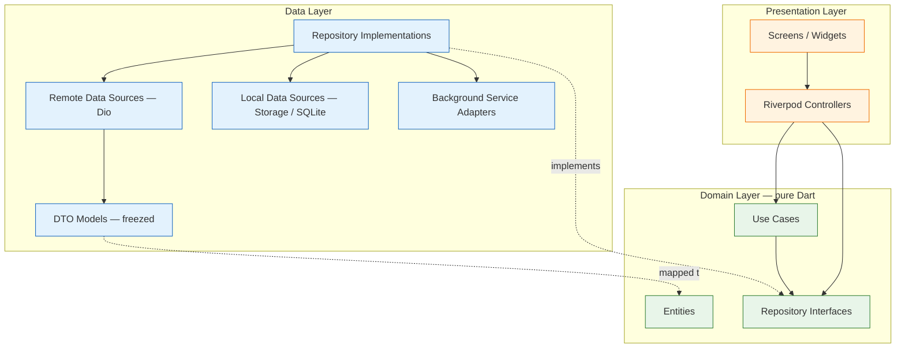
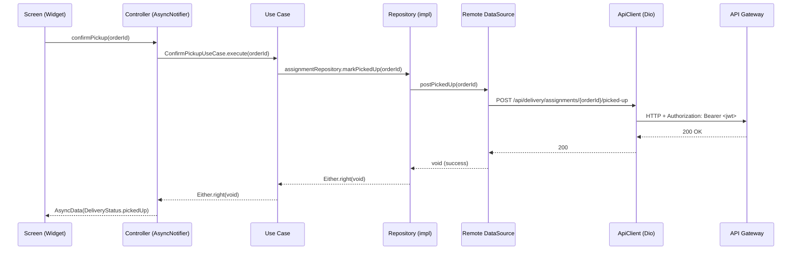
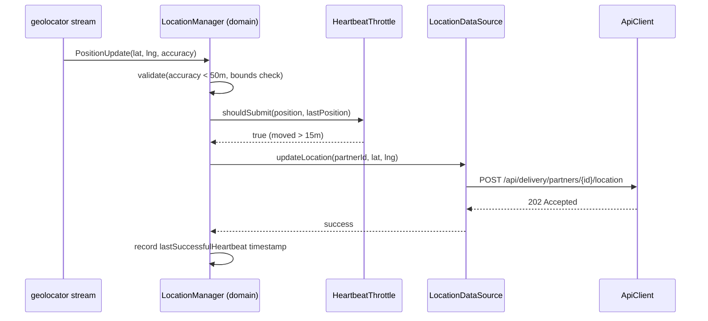
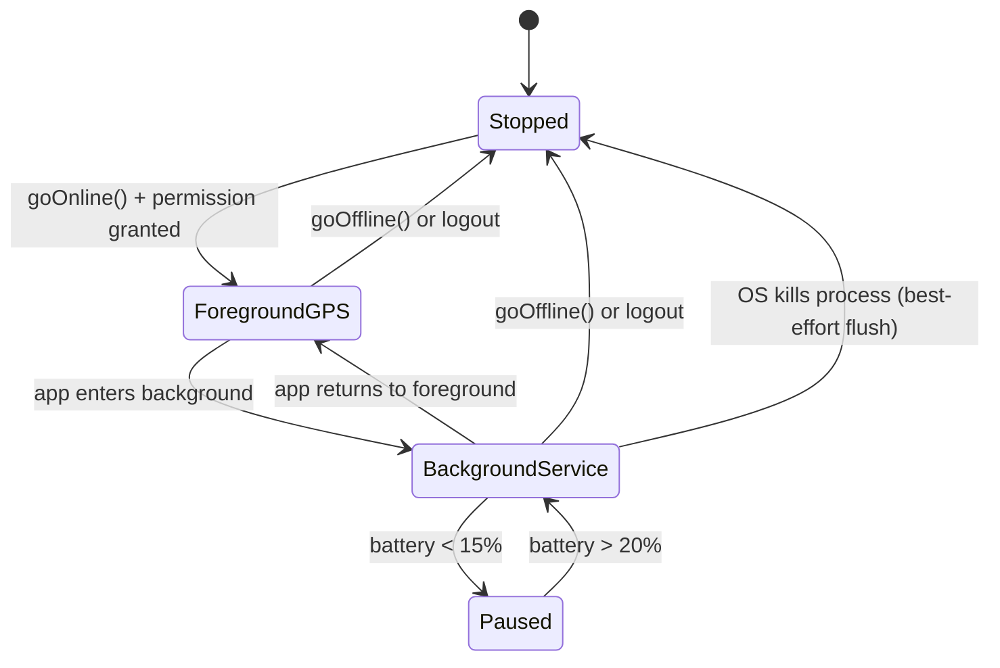
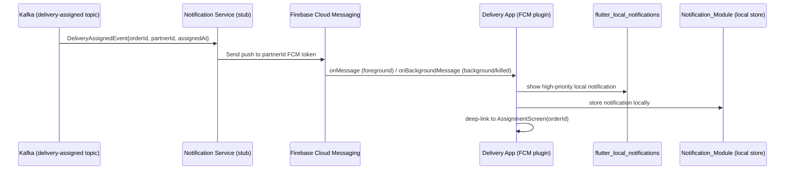
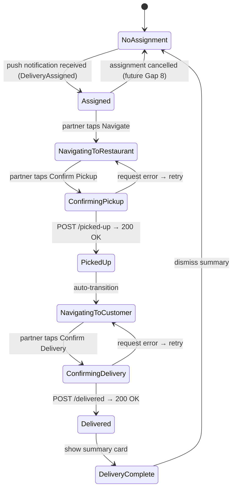
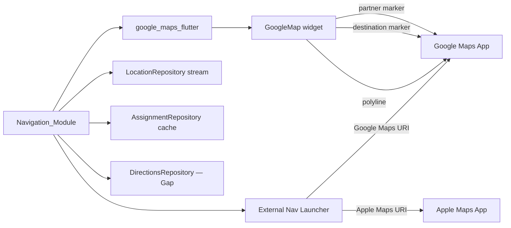

# Design Document — Delivery Partner App

## Overview

The Delivery Partner App is the delivery-partner-facing Flutter client of the existing Food Delivery Platform. It talks to Spring Boot microservices through a single Spring Cloud Gateway base URL. The gateway enforces JWT authentication on every route except `/auth/**` and injects identity headers (`X-User-*`) downstream, so the client never places the partner's identity in request bodies — except for path variables used by the delivery service (`/api/delivery/partners/{id}/*`), which the client resolves from the `PartnerSession.partnerId` stored after login.

This document specifies architecture, layering, networking, location architecture, push-notification architecture, background-processing architecture, maps integration, data models, state management, routing, theming, per-feature design, and testing strategy needed to satisfy all 35 requirements in `requirements.md`. It is a design document: it describes interfaces, contracts, diagrams, and rationale only.

### Design Goals

- **Correctness on the lifecycle.** Every delivery assignment advances through `ASSIGNED → PICKED_UP → DELIVERED` exactly once. State transitions are idempotent HTTP calls with local state guarded against duplicate submissions.
- **Location reliability.** GPS heartbeats reach Redis GEO whether the app is foreground, background, or recently relaunched, across both Android and iOS platform constraints.
- **Gap isolation.** Capabilities without backend endpoints (assignment detail, history, earnings, notifications, profile) sit behind repository interfaces whose local/polling implementations can be swapped for server-backed ones without touching screens.
- **Single auth seam.** Exactly one interceptor attaches the JWT and exactly one interceptor handles HTTP 401, so a future refresh flow drops in without restructuring any request code.
- **Testability.** All pure logic (coordinate validation, heartbeat throttle, earnings calculation, lifecycle state machine) is isolated from I/O for property-based and unit test coverage.
- **Battery efficiency.** The location subsystem adapts its power mode and interval based on assignment state and battery level, satisfying Req 31 without platform-specific workarounds.

### Key Design Decisions

| Decision | Choice | Rationale |
|---|---|---|
| State management | Riverpod with code generation (`@riverpod`) | Same rationale as Customer_App: compile-safe DI, `AsyncValue` sealed union, mockable provider graph. Location stream and assignment state are long-lived `StreamProvider` / `StateNotifier` consumers. |
| Models / serialization | `freezed` + `json_serializable` | Immutable value types with `==`, `copyWith`, exhaustive sealed unions for `DeliveryStatus`, `LocationStatus`. Round-trip property tests are cheap with value equality. |
| Location | `geolocator` + `permission_handler` | De-facto standard; exposes `LocationSettings`, `desiredAccuracy`, `distanceFilter`, and position streams on both platforms. |
| Background location (Android) | `flutter_foreground_task` package | Runs a Dart callback inside an Android foreground service with a persistent notification; bypasses Doze and background-kill. |
| Background location (iOS) | `geolocator` significant-location-change + `BackgroundFetch` | iOS does not permit persistent background processes; significant-location-change wakes the app on large moves, `background_fetch` provides a 15-minute minimum task window. |
| Maps | `google_maps_flutter` | Production-grade rendering, polyline support, camera animation; required for ETA/distance. |
| Push notifications | `firebase_messaging` + `flutter_local_notifications` | FCM transport; local notifications for foreground display and notification history. |
| Result type | `Either<Failure, T>` | Same as Customer_App; forces error-path handling at every call site. |
| Routing | `go_router` with `redirect` | Auth guard driven by `SessionRepository.changes()` stream. |
| Offline queue | In-memory + `SharedPreferences` fallback | Pickup/delivery confirmations queued locally and retried on reconnect; critical because a lost delivery confirmation is a severe UX failure. |
| Money | `Decimal` via JSON converter | Delivery payout amounts from the (future) earnings endpoint will use `BigDecimal` wire format. |

---

## Architecture

### Clean Architecture Layering

Three layers with a strict inward dependency rule — identical structure to the Customer_App.

- **Presentation** — Widgets/screens and Riverpod controllers (`Notifier`/`AsyncNotifier`/`StreamNotifier`). Renders `AsyncValue`/state and dispatches intents. Depends only on domain (entities + repository interfaces).
- **Domain** — Pure Dart. Entities, repository interfaces, lifecycle use cases (`ConfirmPickupUseCase`, `ConfirmDeliveryUseCase`). No Flutter, Dio, or platform imports.
- **Data** — DTOs (freezed/json_serializable), remote data sources (Dio), local data sources (secure storage, prefs, SQLite for history), background location service wrapper, FCM wrapper, and repository implementations that map DTO ↔ entity and return `Either<Failure, T>`.



### Request Flow (end to end)



### GPS Heartbeat Flow



---

## State Management

### Riverpod Conventions (same as Customer_App)

- Code-generated providers with `@riverpod` annotation.
- `AsyncNotifier` for any I/O (auth, assignment, history, earnings).
- `StreamNotifier` for the location status stream and assignment status stream.
- `Notifier` for synchronous local state (availability toggle, theme, cart-style offline queue).
- `autoDispose` on all screen-scoped providers; long-lived providers (session, location stream, availability) stay alive.

### Key Providers

```
sessionProvider            — PartnerSession? (keep-alive)
availabilityProvider       — AvailabilityStatus (online/offline, keep-alive)
locationStatusProvider     — StreamProvider<LocationStatus> (keep-alive when online)
activeAssignmentProvider   — AsyncNotifier<DeliveryAssignment?> (keep-alive)
assignmentLifecycleProvider — Notifier<AssignmentLifecycle> (keep-alive)
earningsProvider           — AsyncNotifier<EarningsSummary>
deliveryHistoryProvider    — AsyncNotifier<PageResult<DeliveryRecord>>
notificationsProvider      — Notifier<List<AppNotification>> (keep-alive)
settingsProvider           — Notifier<AppSettings> (keep-alive)
```

Each repository is bound to its interface through a provider:

```dart
@riverpod
AssignmentRepository assignmentRepository(Ref ref) =>
    AssignmentRepositoryImpl(
      ref.watch(assignmentRemoteDataSourceProvider),
      ref.watch(assignmentLocalDataSourceProvider),
    );

@riverpod
LocationRepository locationRepository(Ref ref) =>
    LocationRepositoryImpl(
      ref.watch(locationServiceProvider),
      ref.watch(locationLocalCacheProvider),
    );
```

---

## Location Architecture

### Overview

The location subsystem is the most complex component of the Delivery_App. It must work across four distinct execution states: foreground, background (app visible on recent-apps), background service, and post-kill restart. The design abstracts each platform's constraints behind a single `LocationRepository` interface.

### LocationRepository Interface

```dart
abstract class LocationRepository {
  /// Stream of the partner's current position (filtered, validated).
  Stream<LatLng> get positionStream;

  /// Lifecycle control.
  Future<Either<Failure, void>> startHeartbeat(HeartbeatConfig config);
  Future<Either<Failure, void>> stopHeartbeat();
  Future<Either<Failure, void>> flushCachedFixes();

  /// Status observation.
  Stream<LocationStatus> get statusStream;

  /// Permission management.
  Future<LocationPermissionLevel> requestPermission();
  LocationPermissionLevel get currentPermissionLevel;
}
```

### HeartbeatConfig

```dart
@freezed
class HeartbeatConfig with _$HeartbeatConfig {
  const factory HeartbeatConfig({
    required int intervalSeconds,       // default 10, 30 when battery < 15%
    required double distanceFilterMeters, // default 15.0
    required LocationAccuracy accuracy, // high when assigned, balanced otherwise
    required int maxRetries,            // default 3
    required Duration retryBackoff,     // default 2s, doubles each retry
  }) = _HeartbeatConfig;
}
```

### LocationStatus Enum

```dart
enum LocationStatus { acquiring, available, gpsDenied, gpsDisabled, unavailable, mockDetected }
```

### Android Background Location (Foreground Service)



**Implementation approach:**
- Use `flutter_foreground_task` to run a separate Dart entry point (`@pragma('vm:entry-point') void startCallback()`) inside an Android foreground service.
- The foreground service entry point creates its own `FlutterEngine`, initialises `geolocator` and a minimal Dio client, and runs the heartbeat loop independently of the UI isolate.
- A persistent notification is shown with `android:foregroundServiceType="location"` declared in `AndroidManifest.xml`.
- The foreground service communicates state back to the UI isolate via `FlutterForegroundTask.sendDataToMain()`.

**AndroidManifest.xml additions required:**
```xml
<uses-permission android:name="android.permission.FOREGROUND_SERVICE" />
<uses-permission android:name="android.permission.FOREGROUND_SERVICE_LOCATION" />
<uses-permission android:name="android.permission.ACCESS_BACKGROUND_LOCATION" />
<service android:name="com.pravera.flutter_foreground_task.service.ForegroundService"
         android:foregroundServiceType="location" />
```

### iOS Background Location

**Constraints:** iOS does not allow persistent background processes. Two complementary mechanisms are used:

1. **Significant Location Change (SLC):** `geolocator` can trigger a position update on cell-tower changes (~500m granularity). The app is woken briefly, submits the latest fix, and suspends again.
2. **Background Fetch (`background_fetch`):** Fires at a minimum 15-minute interval (iOS-controlled). The handler flushes any cached fixes and submits a fresh heartbeat if a GPS fix is available.
3. **`allowsBackgroundLocationUpdates = true`** with `pausesLocationUpdatesAutomatically = false` when the partner is Online with an Active_Assignment — this keeps location updates running while the screen is off but requires `NSLocationAlwaysAndWhenInUseUsageDescription` in `Info.plist`.

**Info.plist additions required:**
```xml
<key>UIBackgroundModes</key>
<array>
    <string>location</string>
    <string>fetch</string>
    <string>remote-notification</string>
</array>
<key>NSLocationAlwaysAndWhenInUseUsageDescription</key>
<string>We use your location to match you with nearby delivery assignments.</string>
<key>NSLocationWhenInUseUsageDescription</key>
<string>We use your location to show your position on the delivery map.</string>
```

### Heartbeat Throttle Logic (pure, testable)

```dart
class HeartbeatThrottle {
  /// Returns true if a new fix should be submitted.
  bool shouldSubmit(LatLng current, LatLng? last, LocationStatus status) {
    if (status != LocationStatus.available) return false;
    if (last == null) return true;
    return _distanceMeters(current, last) >= distanceFilterMeters;
  }

  double _distanceMeters(LatLng a, LatLng b) { /* Haversine */ }
}
```

This pure function has no side effects and is property-tested: for any pair of positions within the filter radius, `shouldSubmit` returns false; for any pair outside, it returns true.

---

## Push Notification Architecture



### Notification Payload Structure (expected)

The Notification service (currently a stub — Gap 6) must eventually emit FCM data payloads in this structure:

```json
{
  "type": "DELIVERY_ASSIGNED | ORDER_READY_FOR_PICKUP | ORDER_CANCELLED | SYSTEM",
  "orderId": "uuid",
  "title": "New Delivery Assignment",
  "body": "You have a new delivery nearby",
  "timestamp": "ISO-8601"
}
```

### FCM Handler Registration

```dart
// main.dart — top-level background handler (required by firebase_messaging)
@pragma('vm:entry-point')
Future<void> firebaseMessagingBackgroundHandler(RemoteMessage message) async {
  await Firebase.initializeApp();
  await NotificationService.handleBackground(message);
}
```

### NotificationRepository Interface

```dart
abstract class NotificationRepository {
  Future<void> saveNotification(AppNotification notification);
  Future<List<AppNotification>> getAll();
  Future<void> markAllRead();
  Future<void> clear();
  Stream<int> get unreadCount;
}
```

---

## Assignment Lifecycle Design

### AssignmentStatus State Machine



### AssignmentRepository Interface

```dart
abstract class AssignmentRepository {
  /// Fetch the current active assignment from cache or backend.
  Future<Either<Failure, DeliveryAssignment?>> getActiveAssignment();

  /// Cache assignment received from push notification payload.
  Future<void> cacheAssignment(DeliveryAssignment assignment);

  /// Advance status to PICKED_UP — POST /api/delivery/assignments/{id}/picked-up.
  Future<Either<Failure, void>> markPickedUp(String orderId);

  /// Advance status to DELIVERED — POST /api/delivery/assignments/{id}/delivered.
  Future<Either<Failure, void>> markDelivered(String orderId);

  /// Clear the cached assignment on completion.
  Future<void> clearAssignment();
}
```

### Offline Confirmation Queue

When a `markPickedUp` or `markDelivered` call fails due to no connectivity, the payload is persisted to `SharedPreferences` in a serialised queue. A `ConnectivityRepository` stream triggers a drain attempt on reconnect.

```dart
abstract class OfflineQueue {
  Future<void> enqueue(PendingConfirmation item);
  Future<List<PendingConfirmation>> drain();
  Future<void> remove(String id);
}

@freezed
class PendingConfirmation with _$PendingConfirmation {
  const factory PendingConfirmation({
    required String id,
    required String orderId,
    required ConfirmationType type, // pickUp | deliver
    required DateTime enqueuedAt,
    required int retryCount,
  }) = _PendingConfirmation;
}
```

---

## Maps Architecture

### Google Maps Flutter Integration



### NavigationRepository Interface

```dart
abstract class NavigationRepository {
  /// Get route from origin to destination.
  /// Uses Google Directions API or falls back to straight-line bearing.
  Future<Either<Failure, RouteInfo>> getRoute(LatLng origin, LatLng destination);

  /// Launch external navigation app.
  Future<void> launchExternalNav(LatLng destination, String label);
}

@freezed
class RouteInfo with _$RouteInfo {
  const factory RouteInfo({
    required List<LatLng> polylinePoints,
    required double distanceKm,
    required int etaMinutes,
  }) = _RouteInfo;
}
```

> **Note:** Google Directions API requires a Maps API key with Directions enabled. The initial implementation may use a straight-line distance calculation (Haversine) as a fallback when the API key is not configured. Document this clearly in the app's README.

### External Navigation Launcher

```dart
// Deep link format examples:
// Google Maps: 'google.navigation:q=${lat},${lng}&mode=d'
// Apple Maps:  'maps://?daddr=${lat},${lng}&dirflg=d'
// Web fallback: 'https://www.google.com/maps/dir/?api=1&destination=${lat},${lng}'
```

---

## Networking Layer

Identical structure to the Customer_App with one addition: the `PartnerIdInterceptor` that injects the `partnerId` as a convenience for path-variable construction.

### Interceptor Chain (ordered)

1. `AuthInterceptor` — attaches `Authorization: Bearer <token>` on non-`/auth/**` paths.
2. `LoggingInterceptor` — redacts token, password, lat/lng values from logs.
3. `RetryInterceptor` — exponential backoff on idempotent GET requests and 202/timeout; never retries 4xx.
4. `UnauthorizedInterceptor` (`QueuedInterceptor`) — single 401 seam: clears session, emits `SessionExpired`, pauses location heartbeat.
5. `ErrorInterceptor` — maps `DioException` → `AppException` → `Failure`.

### ApiClient Methods

```dart
// GPS heartbeat — fire-and-forget (202 Accepted)
Future<void> postLocation(String partnerId, double lat, double lng, CancelToken? ct);

// Availability
Future<void> postOnline(String partnerId, CancelToken? ct);
Future<void> postOffline(String partnerId, CancelToken? ct);

// Assignment lifecycle
Future<void> postPickedUp(String orderId, CancelToken? ct);
Future<void> postDelivered(String orderId, CancelToken? ct);
```

---

## Routing

### GoRouter Table

```
/splash                          → SplashScreen (session check)
/login                           → LoginScreen
/register                        → RegisterScreen
/ (ShellRoute — auth guard)
  /home                          → HomeScreen (availability + active assignment)
  /assignment/:orderId           → AssignmentDetailScreen
  /navigate/:orderId/:destination → NavigationScreen (restaurant|customer)
  /history                       → DeliveryHistoryScreen
  /earnings                      → EarningsScreen
  /profile                       → ProfileScreen
  /notifications                 → NotificationCenterScreen
  /settings                      → SettingsScreen
```

### Auth Guard

```dart
redirect: (context, state) {
  final session = ref.read(sessionProvider);
  final isAuth = session != null && !session.isExpired;
  final isOnAuthPath = state.matchedLocation.startsWith('/login') ||
                       state.matchedLocation.startsWith('/register');
  if (!isAuth && !isOnAuthPath) return '/login';
  if (isAuth && isOnAuthPath) return '/home';
  return null;
}
```

### Deep Link Handling

FCM data payloads carry `type` and `orderId`. On notification tap:
- `DELIVERY_ASSIGNED` → `/assignment/${orderId}`
- `ORDER_READY_FOR_PICKUP` → `/navigate/${orderId}/restaurant`
- `SYSTEM` → `/notifications`

---

## Folder Structure

```text
lib/
├── main.dart                         # bootstrap: ProviderScope, Firebase init, FCM background handler
├── app.dart                          # MaterialApp.router + theme wiring
├── core/
│   ├── network/
│   │   ├── api_client.dart
│   │   ├── dio_provider.dart
│   │   ├── interceptors/
│   │   │   ├── auth_interceptor.dart
│   │   │   ├── logging_interceptor.dart    # redacts token, password, lat/lng
│   │   │   ├── retry_interceptor.dart
│   │   │   ├── unauthorized_interceptor.dart
│   │   │   └── error_interceptor.dart
│   │   └── api_response.dart
│   ├── error/
│   │   ├── app_exception.dart
│   │   ├── failure.dart
│   │   └── result.dart
│   ├── storage/
│   │   ├── secure_storage.dart
│   │   └── preferences.dart
│   ├── routing/
│   │   ├── app_router.dart
│   │   └── routes.dart
│   ├── theme/
│   │   ├── app_tokens.dart
│   │   ├── app_theme.dart
│   │   └── theme_extensions.dart
│   ├── location/
│   │   ├── heartbeat_throttle.dart         # pure: distance filter + battery logic
│   │   ├── coordinate_validator.dart       # pure: bounds + accuracy check
│   │   ├── background_location_service.dart # Android FGS adapter
│   │   └── location_permission_handler.dart
│   ├── offline_queue/
│   │   ├── offline_queue.dart
│   │   └── pending_confirmation.dart
│   ├── notifications/
│   │   ├── fcm_service.dart               # firebase_messaging wiring
│   │   └── local_notification_service.dart
│   ├── constants/
│   ├── utils/
│   ├── validation/
│   ├── extensions/
│   └── widgets/                           # shared widget catalog
│       ├── loading_overlay.dart
│       ├── error_state.dart
│       ├── empty_state.dart
│       ├── shimmer_list.dart
│       ├── status_badge.dart
│       └── offline_banner.dart
├── features/
│   ├── authentication/
│   │   ├── data/
│   │   │   ├── dtos/                      # auth_response_dto, user_response_dto
│   │   │   ├── datasources/               # auth_remote_datasource
│   │   │   └── repositories/              # auth_repository_impl, session_repository_impl
│   │   ├── domain/
│   │   │   ├── entities/                  # partner_session, identity_claims
│   │   │   └── repositories/              # i_auth_repository, i_session_repository
│   │   └── presentation/
│   │       ├── screens/                   # login, register
│   │       └── controllers/               # auth_controller, session_controller
│   ├── availability/
│   │   ├── data/
│   │   │   ├── datasources/               # availability_remote_datasource
│   │   │   └── repositories/              # availability_repository_impl
│   │   ├── domain/
│   │   │   ├── entities/                  # availability_status
│   │   │   └── repositories/              # i_availability_repository
│   │   └── presentation/
│   │       ├── screens/                   # home_screen (availability toggle)
│   │       └── controllers/               # availability_controller
│   ├── location/
│   │   ├── data/
│   │   │   ├── datasources/               # location_datasource (geolocator wrapper)
│   │   │   ├── local/                     # location_cache (SharedPreferences)
│   │   │   └── repositories/              # location_repository_impl
│   │   ├── domain/
│   │   │   ├── entities/                  # lat_lng, heartbeat_config, location_status
│   │   │   └── repositories/              # i_location_repository
│   │   └── presentation/
│   │       └── controllers/               # location_controller (StreamNotifier)
│   ├── assignment/
│   │   ├── data/
│   │   │   ├── dtos/                      # assignment_dto, assignment_detail_dto
│   │   │   ├── datasources/               # assignment_remote_datasource
│   │   │   ├── local/                     # assignment_local_cache
│   │   │   └── repositories/              # assignment_repository_impl
│   │   ├── domain/
│   │   │   ├── entities/                  # delivery_assignment, delivery_status
│   │   │   ├── repositories/              # i_assignment_repository
│   │   │   └── usecases/                  # confirm_pickup_usecase, confirm_delivery_usecase
│   │   └── presentation/
│   │       ├── screens/                   # assignment_detail_screen
│   │       └── controllers/               # assignment_controller
│   ├── navigation/
│   │   ├── data/
│   │   │   └── repositories/              # navigation_repository_impl
│   │   ├── domain/
│   │   │   ├── entities/                  # route_info
│   │   │   └── repositories/              # i_navigation_repository
│   │   └── presentation/
│   │       ├── screens/                   # navigation_screen
│   │       └── controllers/               # navigation_controller
│   ├── history/
│   │   ├── data/
│   │   │   ├── local/                     # history_local_datasource (SQLite)
│   │   │   └── repositories/              # history_repository_impl
│   │   ├── domain/
│   │   │   ├── entities/                  # delivery_record, page_result
│   │   │   └── repositories/              # i_history_repository
│   │   └── presentation/
│   │       ├── screens/                   # history_screen
│   │       └── controllers/               # history_controller
│   ├── earnings/
│   │   ├── data/
│   │   │   └── repositories/              # earnings_repository_impl (local computation)
│   │   ├── domain/
│   │   │   ├── entities/                  # earnings_summary, daily_earnings
│   │   │   └── repositories/              # i_earnings_repository
│   │   └── presentation/
│   │       ├── screens/                   # earnings_screen
│   │       └── controllers/               # earnings_controller
│   ├── profile/
│   │   ├── data/
│   │   │   └── repositories/              # profile_repository_impl
│   │   ├── domain/
│   │   │   └── repositories/              # i_profile_repository
│   │   └── presentation/
│   │       ├── screens/                   # profile_screen
│   │       └── controllers/               # profile_controller
│   ├── notifications/
│   │   ├── data/
│   │   │   └── repositories/              # notification_repository_impl (local)
│   │   ├── domain/
│   │   │   └── repositories/              # i_notification_repository
│   │   └── presentation/
│   │       ├── screens/                   # notification_center_screen
│   │       └── controllers/               # notifications_controller
│   └── settings/
│       ├── data/
│       │   └── repositories/              # settings_repository_impl
│       ├── domain/
│       │   └── repositories/              # i_settings_repository
│       └── presentation/
│           ├── screens/                   # settings_screen
│           └── controllers/               # settings_controller
```

---

## DTO and Entity Catalog

### Auth DTOs (verified against backend)

```dart
// POST /auth/login/delivery-person → AuthResponseDto
@freezed class AuthResponseDto {
  String token;
  String userId;    // maps to partnerId
  String fullName;
  String email;
  String role;      // "DELIVERY_PERSON"
}

// POST /auth/register/delivery → UserResponseDto
@freezed class UserResponseDto {
  String id;
  String fullName;
  String email;
  String phone;
  String role;
}
```

### Domain Entities

```dart
@freezed class PartnerSession {
  String partnerId;
  String email;
  String role;
  String name;
  String phone;
  DateTime exp;
  bool get isExpired => DateTime.now().isAfter(exp);
}

@freezed class DeliveryAssignment {
  String orderId;
  String restaurantName;         // from enriched push payload (Gap 7)
  String restaurantAddress;      // from enriched push payload (Gap 7)
  LatLng restaurantLocation;     // from enriched push payload (Gap 7)
  String customerFirstName;      // from enriched push payload (Gap 7)
  String customerAddress;        // from enriched push payload (Gap 7)
  LatLng customerLocation;       // from enriched push payload (Gap 7)
  int itemCount;                 // from enriched push payload (Gap 7)
  DeliveryStatus status;
  DateTime assignedAt;
}

enum DeliveryStatus { assigned, pickedUp, delivered }

@freezed class DeliveryRecord {
  String orderId;
  DateTime deliveredAt;
  String pickupAddress;
  String dropAddress;
  double distanceKm;
  Decimal payout;
}

@freezed class EarningsSummary {
  Decimal todayTotal;
  int todayDeliveries;
  Decimal weekTotal;
  int weekDeliveries;
  Decimal allTimeTotal;
  int allTimeDeliveries;
  List<DailyEarning> weekBreakdown;
}
```

### Location Entities

```dart
@freezed class LatLng {
  double latitude;
  double longitude;
}

@freezed class HeartbeatResult {
  bool submitted;
  bool skipped;              // distance filter
  bool cached;               // offline
  DateTime timestamp;
}
```

---

## Error Handling Strategy

Every screen handles five states via `AsyncValue`:

| State | Widget |
|---|---|
| Loading (first load) | `ShimmerList` or `LoadingOverlay` |
| Refreshing (subsequent) | Pull-to-refresh indicator |
| Offline | `OfflineBanner` + last cached data |
| Error | `ErrorState` with retry control |
| Empty | `EmptyState` with contextual message |

Assignment-specific states (beyond generic):

| State | Trigger | Widget |
|---|---|---|
| No active assignment | Partner online, no pending order | "Waiting for assignment" idle card |
| Assignment arriving | FCM notification | In-app banner + assignment card |
| GPS unavailable | `LocationStatus.gpsDisabled` | Yellow warning banner on home screen |
| Permission denied | `LocationStatus.gpsDenied` | Persistent warning + settings shortcut |
| Confirmation in-progress | Pickup/delivery request in flight | Button disabled + spinner |
| Confirmation queued | Offline + pending confirmation | "Queued — will send when online" badge |

---

## Testing Strategy

### Property-Based Tests (fast_check)

| # | Property | Module | Iterations |
|---|---|---|---|
| P-1 | Round-trip: `fromJson(toJson(dto)) == dto` for all DTOs | All data models | 100 |
| P-2 | `HeartbeatThrottle.shouldSubmit` returns false for any position within 15m of last | Location | 100 |
| P-3 | `CoordinateValidator.validate` rejects any lat outside [-90,90] or lng outside [-180,180] | Location | 100 |
| P-4 | JWT claims decode round-trip: encode claims → JWT → decode → equal claims | Auth | 100 |
| P-5 | Auth header attached iff path not under `/auth/` | Network | 100 |
| P-6 | Failure classification: any DioException maps to exactly one Failure | Network | 100 |
| P-7 | `EarningsCalculator`: sum of payout fields in any set of DeliveryRecords equals computed total | Earnings | 100 |
| P-8 | `AssignmentStateMachine`: no transition from `delivered` to any other state | Assignment | 100 |
| P-9 | `OfflineQueue.drain` returns items in FIFO enqueue order | Offline queue | 100 |
| P-10 | Contrast ratio ≥ 4.5:1 for all body text token pairs in light and dark themes | Theme | 100 |

### Widget Tests

- `HomeScreen` renders Online/Offline toggle in correct initial state.
- `AssignmentDetailScreen` disables Confirm Pickup when status is `pickedUp`.
- `NavigationScreen` switches destination marker when status transitions from `assigned` to `pickedUp`.
- `LoginScreen` blocks submission while request is in-flight.
- `RegisterScreen` shows field errors from server 400 response.

### Repository Tests (mock datasource)

- `AssignmentRepositoryImpl.markPickedUp` returns `Either.right` on 200; `Either.left(ServerFailure)` on 5xx.
- `LocationRepositoryImpl` does not submit heartbeat when `shouldSubmit` returns false.
- `OfflineQueue` persists to preferences and drains in order on reconnect.

### Integration Tests

- Full login → go online → location heartbeat → assignment notification → navigate → pickup → navigate → deliver → go offline flow using a mock server.
