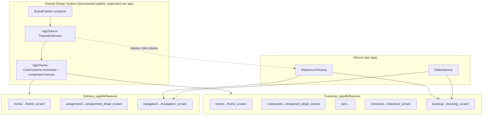
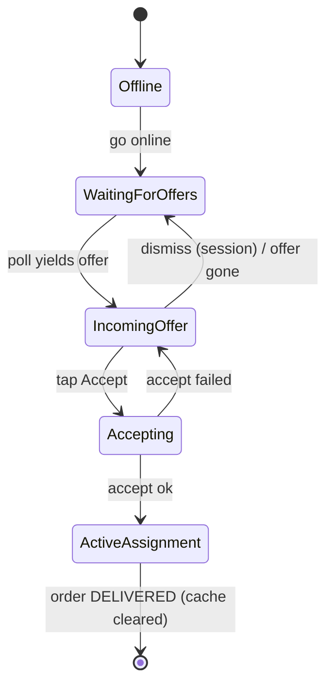
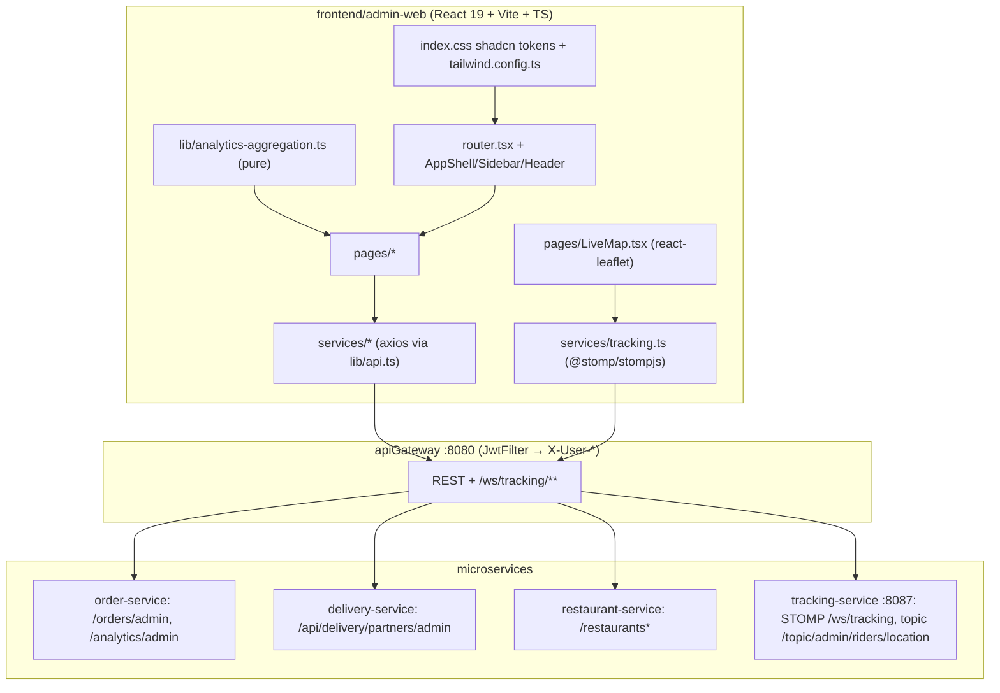

# Design Document: UI Modernization (Customer & Delivery apps)

## Overview

This feature is a frontend-only UI/UX overhaul of the two Flutter apps in this repository —
`frontend/Customer_app` and `frontend/Delivery_app` — plus one explicitly-scoped backend
**guard** for delivery-completion integrity. The backend is otherwise complete and is not
touched.

The work is grouped into eight changes:

1. Custom rider/scooter map marker (both apps), replacing the default colored Google Maps pins.
2. A reactive item-count badge on the cart icon (customer app).
3. Removing the rider's "Confirm Delivery" button and guaranteeing an order can only be
   completed by the **customer**, while keeping the rider-release flow intact.
4. Hiding raw latitude/longitude from the customer at checkout while keeping GPS/geocoding.
5. A modern visual refresh of both apps, built on the existing `AppTokens` `ThemeExtension`.
6. Tappable call icons that open the native dialer (`tel:`) on Android and iOS.
7. A redesigned delivery "assignment / new offer" experience with polished cards and animation.
8. A single, consistent, documented color system applied across both apps.

The guiding principle is **refinement, not rewrite**: live tracking, location publishing,
geocoding-based delivery location, marker animation/bearing, and partner identity all keep
working exactly as they do today. We layer modern styling and a handful of behavioral
corrections on top of the existing architecture (Riverpod + codegen, freezed, `AppTokens`,
`google_maps_flutter`, `geolocator`).

## Goals

- One cohesive, production-looking visual identity shared by both apps, anchored on the brand
  green `#2B9E49`.
- Replace ad-hoc hardcoded colors and default map pins with tokenized, intentional design.
- Close the delivery-completion integrity gap (rider self-completion) with explicit,
  testable guarantees.
- Improve three rough interaction points: cart visibility, checkout simplicity, and the
  delivery offer/assignment flow.
- Make the call action actually work on both platforms.

## Non-Goals

- No new product features (no new screens beyond what's needed to host redesigned components).
- No backend feature work beyond the single delivery-completion guard described in Item 3.
- No change to the tracking/location transport, the STOMP socket, Kafka topology, or the
  geocoding/directions services.
- No new state management or navigation library; we stay on Riverpod + go_router.

---

## Architecture

Both apps follow the same feature-first layout (`lib/features/<feature>/{data,domain,presentation}`)
with cross-cutting code under `lib/core/`. The modernization touches three layers:



Because the two apps are **separate Flutter packages** with no shared package, the design system
is expressed as a **canonical palette documented here** and implemented as a small, identical
constants block in each app's theme layer (see Item 8). This keeps scope minimal (no monorepo
package wiring) while guaranteeing both apps render the same colors.

### Theming entry points (verified)

| App | Theme file | Seed today | Tokens shape |
|-----|-----------|-----------|--------------|
| Customer | `lib/core/theme/app_theme.dart` | `Colors.deepOrange` (wrong) | rich: semantic + 9 order-status colors + spacing/radius/elevation, `const light/dark` |
| Delivery | `lib/core/theme/app_theme.dart` | `Color(0xFF6750A4)` purple (wrong) | `primary` + success/warning/error + `deliveryStatusColors` map, factory `light()/dark()` |

Both currently hardcode the brand green `Color(0xFF2B9E49)` directly in screen headers
(`tracking_screen.dart`, `navigation_screen.dart`) rather than deriving it from the theme — a
key source of the "dated / inconsistent" feel. The refresh routes all brand color through the
theme.

---

## Shared Design System

### Color palette (canonical)

The brand is a confident green. Surfaces are generated by `ColorScheme.fromSeed(brand)` so
Material 3 produces accessible on-colors and container tones automatically; the table below is
the documented source of truth that both apps replicate.

| Role | Light | Dark | Notes |
|------|-------|------|-------|
| `brandPrimary` (seed) | `#2B9E49` | `#2B9E49` | brand green; ColorScheme seed for both apps |
| `brandPrimaryDark` | `#1F7A38` | `#1F7A38` | pressed/scrim, header gradients |
| `success` | `#2E7D32` | `#66BB6A` | matches customer's current success |
| `warning` | `#E65100` | `#FFB74D` | |
| `error` | `#C62828` | `#EF9A9A` | |
| `info` | `#0277BD` | `#4FC3F7` | |
| `riderMarker` | `#2B9E49` | `#2B9E49` | rider/scooter puck fill |
| `customerMarker` | `#1565C0` | `#1565C0` | customer/home pin |
| `restaurantMarker` | `#E65100` | `#E65100` | restaurant pin |

Order/delivery **status** colors keep their current semantics (the customer app already has a
9-value status palette; the delivery app has a 3-value map) but are re-grounded so the
`delivered`/`outForDelivery` greens align with `brandPrimary`/`success`.

### Typography scale

The customer app already defines a full Material 3 `TextTheme` in `app_theme.dart`; the delivery
app defines **none**. The refresh:

- Customer: keep the existing scale (display→label), minor weight tuning for titles.
- Delivery: add the **same** `TextTheme` builder so both apps share one type ramp.

Canonical ramp (unchanged from customer app today): `displayLarge 57` … `titleLarge 22/w500`,
`titleMedium 16/w500`, `bodyLarge 16`, `bodyMedium 14`, `labelLarge 14/w500`, `labelSmall 11`.

### Spacing, radius, elevation

Both token sets already expose a 4-pt spacing scale, radius, and elevation. We standardize the
**names** conceptually (xs/sm/md/lg/xl) and keep each app's existing field names to avoid a wide
rename; values are aligned (radius md = 12, pill = 999, card elevation level 1). Components use
tokens instead of literals.

### Component styles (applied via `ThemeData`)

Neither app currently sets component themes (only the delivery app sets a flat `appBarTheme`).
The refresh adds, in each app's `AppTheme`:

- `cardTheme`: `radiusLg`, `elevationLevel1`, `clipBehavior: antiAlias`, surfaceTint off.
- `filledButtonTheme` / `outlinedButtonTheme`: pill or `radiusMd`, min height 48–52, label
  `labelLarge`.
- `inputDecorationTheme`: filled, `radiusMd`, consistent content padding, focused border in
  `brandPrimary`.
- `appBarTheme`: surface background, no elevation, centered/standard titles, brand-tinted icons.
- `chipTheme`, `snackBarTheme` (floating), `dividerTheme`.
- Reusable empty/loading/error widgets (customer already uses `shimmer`/`lottie`; both get a
  shared `EmptyState`, `LoadingState`, and `ErrorState` widget under `lib/core/widgets/`).

### AppTokens reconciliation

We keep each app's `AppTokens` file but extend both with **marker color tokens** and align the
brand. Example (customer app, additive fields shown):

```dart
// lib/core/theme/app_tokens.dart (customer) — additive marker tokens
class AppTokens extends ThemeExtension<AppTokens> {
  // ...existing semantic + status + spacing/radius/elevation fields...
  final Color riderMarker;      // brand green
  final Color customerMarker;   // blue
  final Color restaurantMarker; // orange
  // copyWith / lerp updated to include the three new colors
}
```

```dart
// lib/core/theme/brand_palette.dart (NEW, identical in both apps)
abstract final class BrandPalette {
  static const brandPrimary     = Color(0xFF2B9E49);
  static const brandPrimaryDark = Color(0xFF1F7A38);
  static const riderMarker      = Color(0xFF2B9E49);
  static const customerMarker   = Color(0xFF1565C0);
  static const restaurantMarker = Color(0xFFE65100);
  // success/warning/error/info ... (light & dark)
}
```

Both `AppTheme.light()/dark()` switch their seed to `BrandPalette.brandPrimary`.

---

## Item 1 — Custom rider/scooter marker (both apps)

### Current state (verified)

- Customer `tracking_screen.dart`: markers `customer` (`hueAzure`), `rider`
  (`hueRed`, `rotation: _markerAnimator.bearing`, `anchor: (0.5,0.5)`, gated by
  `_hasRiderLocation`), `restaurant` (`hueOrange`).
- Delivery `navigation_screen.dart`: `destination` (`hueOrange`/`hueRed`), `rider`
  (`hueBlue`, `rotation: _markerAnimator.bearing`, `anchor: (0.5,0.5)`).
- `MarkerAnimator` (`lib/core/maps/marker_animator.dart`) already supplies smooth
  interpolation (`currentValue`) and `bearing`. This stays untouched.
- Neither app declares an `assets/` folder or `flutter: assets:` in `pubspec.yaml`.

### Strategy decision

Two options were considered:

| Option | Pros | Cons |
|--------|------|------|
| A. Asset PNG (`BitmapDescriptor.asset/fromAssetImage`) | simplest API, designer-authored art | requires shipping density-bucketed PNGs + new `assets/` wiring in both apps; we have no art |
| **B. Render-to-bitmap (Canvas → `BitmapDescriptor.bytes`)** (recommended) | no binary assets, density-correct, themeable (uses token colors), one code path | a bit more code (a painter) |

We choose **B**: a `MarkerIconFactory` that paints a circular "puck" marker (a colored disc with
a white scooter glyph drawn from the MaterialIcons font, e.g. `Icons.two_wheeler`) onto a
`Canvas` at the current `devicePixelRatio`, returning a cached `BitmapDescriptor`. A circular
puck (vs. a teardrop pin) rotates cleanly under `MarkerAnimator.bearing` and reads as a moving
vehicle, similar to mainstream delivery apps. Asset PNGs remain a drop-in alternative if a
designer later supplies art.

### Interface

```dart
// lib/core/maps/marker_icon_factory.dart  (one copy per app)
class MarkerIconFactory {
  /// Renders a circular vehicle "puck" marker tinted [color] with a white glyph.
  /// Cached by (icon, color, sizeDp, dpr) so we paint once per distinct marker.
  Future<BitmapDescriptor> vehiclePuck({
    required Color color,        // tokens.riderMarker
    IconData icon = Icons.two_wheeler,
    double sizeDp = 44,
    required double devicePixelRatio,
  });

  /// Optional: a teardrop pin for static points (customer/restaurant) if we
  /// later replace those defaults too. Out of scope unless requested.
  void clearCache();
}
```

Implementation notes (both apps):

- Paint with `ui.PictureRecorder` + `Canvas`: filled circle (`color`), thin white ring for
  contrast on the map, glyph via `TextPainter` using `TextStyle(fontFamily: 'MaterialIcons')`
  and `String.fromCharCode(icon.codePoint)`.
- Convert with `picture.toImage(px, px)` → `image.toByteData(format: png)` →
  `BitmapDescriptor.bytes(bytes, imagePixelRatio: dpr)`.
- Build lazily in `initState`/first frame (need `MediaQuery.devicePixelRatioOf(context)`), store
  in state; until ready, fall back to the existing default marker so the map never blanks.
- Keep `rotation: _markerAnimator.bearing` and `anchor: const Offset(0.5, 0.5)` exactly as now.

### Generation flow

```mermaid
sequenceDiagram
    participant S as Tracking/Navigation Screen
    participant F as MarkerIconFactory
    participant M as GoogleMap

    S->>S: first frame: read devicePixelRatio + tokens.riderMarker
    S->>F: vehiclePuck(color, dpr)
    F-->>S: BitmapDescriptor (cached)
    Note over S: store in state; setState
    S->>M: Marker(rider, icon: puck, rotation: bearing, anchor 0.5/0.5)
    Note over S,M: location stream → MarkerAnimator.animateTo (unchanged)
```

### Affected files

- NEW `Customer_app/lib/core/maps/marker_icon_factory.dart`
- NEW `Delivery_app/lib/core/maps/marker_icon_factory.dart`
- EDIT `Customer_app/lib/features/tracking/presentation/tracking_screen.dart` (rider marker icon)
- EDIT `Delivery_app/lib/features/navigation/presentation/screens/navigation_screen.dart` (rider marker icon)

---

## Item 2 — Cart item-count badge (customer app)

### Current state (verified)

The cart icon (`Icons.shopping_cart_outlined` → `context.push(AppRoutes.cart)`) appears in two
AppBars:

- `home/presentation/screens/home_screen.dart` (line ~31)
- `restaurant/presentation/restaurant_detail_screen.dart` (line ~65)

Cart state lives in `CartController` (`@Riverpod(keepAlive: true)`); the `Cart` entity already
exposes `int get totalItems` (sum of line quantities). No state change is required.

### Design

A reusable `CartIconButton` (Riverpod `ConsumerWidget`) wraps the Material 3 `Badge` around the
existing icon, reads `totalItems`, hides at zero, and preserves the existing navigation +
tooltip. No new dependency (Material `Badge` ships with Flutter; SDK is 3.11).

```dart
// lib/features/cart/presentation/widgets/cart_icon_button.dart (NEW)
class CartIconButton extends ConsumerWidget {
  const CartIconButton({super.key});

  @override
  Widget build(BuildContext context, WidgetRef ref) {
    final count = ref.watch(
      cartControllerProvider.select((c) => c.totalItems),
    );
    return IconButton(
      tooltip: 'Cart',
      onPressed: () => context.push(AppRoutes.cart),
      icon: Badge(
        isLabelVisible: count > 0,
        label: Text('$count'),              // capped display e.g. "9+" if > 9
        child: const Icon(Icons.shopping_cart_outlined),
      ),
    );
  }
}
```

- `select((c) => c.totalItems)` rebuilds only when the count changes.
- Badge label: show the number; for large carts display `99+` to avoid overflow.
- Accessibility: `Semantics` label "Cart, N items" so screen readers announce the count.

### Affected files

- NEW `cart/presentation/widgets/cart_icon_button.dart`
- EDIT `home/.../home_screen.dart` and `restaurant/.../restaurant_detail_screen.dart` (replace
  the inline `IconButton` with `CartIconButton`)

---

## Item 3 — Remove rider "Confirm Delivery" + completion integrity

This is the one item with a behavioral guarantee, so it gets the most rigor.

### Current state (verified end-to-end)

There are **two independent completion paths** today:

**Path A — rider self-completes (to be removed):**

```
Delivery app: assignment_detail_screen.dart (pickedUp state)
  "Confirm Delivery" → AssignmentController.confirmDelivery()
  → ConfirmDeliveryUseCase → AssignmentRepository.markDelivered(orderId)
  → POST /api/delivery/assignments/{orderId}/delivered
Backend delivery: DeliveryAssignmentController.markDelivered
  → DeliveryAssignmentService.completeDelivery(orderId, partnerId)
     - requires assignment status == PICKED_UP
     - assignment → DELIVERED
     - deliveryPartnerService.markAvailable(partnerId)   ← FREES THE RIDER
     - emits OrderDeliveredEvent → topic "order-delivered"
Backend order: OrderDeliveredConsumer → status → DELIVERED  ← COMPLETES ORDER
```

**Path B — customer confirms (to be the only path):**

```
Customer app: tracking_screen.dart "Confirm Order Received"
  → POST /orders/{orderId}/receive
Backend order: OrderController.markOrderDelivered  [@PreAuthorize CUSTOMER]
  → OrderServiceImpl.markOrderDelivered(orderId, customerId)
     - requires order.customerId == customerId (ownership)
     - requires status == OUT_FOR_DELIVERY
     - order → DELIVERED
     - emits OrderDeliveredEvent → topic "order-delivered"
Backend order: OrderDeliveredConsumer → status → DELIVERED (idempotent)
```

**Critical finding:** `markAvailable(...)` — the *only* post-assignment rider-release path —
is called *exclusively* inside `DeliveryAssignmentService.completeDelivery`, i.e. only from
Path A. The **delivery service has no consumer for the `order-delivered` topic** (verified:
`KafkaConsumerConfig` defines factories only for `PaymentCompletedEvent`,
`DeliveryPartnerCreatedEvent`, `OrderReadyForPickupEvent`; consumers are
`OrderReadyForPickupConsumer`, `PaymentEventConsumer`, `DeliveryPartnerCreatedConsumer`).

Consequences:

- Today a rider **can** complete an order with no customer action (Path A) — the integrity hole
  Item 3 closes.
- If we **only** delete the rider button (pure frontend), order completion still works via Path
  B, **but the rider is never freed**: `markAvailable` is never reached, the delivery
  assignment is stuck at `PICKED_UP` on the backend, and `DeliveryPartner.available` stays
  `false`. (The app's `getActiveAssignment()` does clear the *local* cache once it sees the
  order is `DELIVERED`, so the rider's screen frees up — but the backend partner record does
  not, which is the regression we must prevent.)
- Removing the Flutter button does **not** remove the REST endpoint: `POST
  /api/delivery/assignments/{orderId}/delivered` remains reachable (it only relies on gateway
  auth + `ensureAssignedPartner`), so an old build or direct call could still self-complete.

### Behavioral guarantee (the contract)

- **G1 (customer-only completion):** an order transitions to `DELIVERED` **only** as a result
  of the customer's authenticated `POST /orders/{id}/receive` for their own order in
  `OUT_FOR_DELIVERY`. No rider-initiated action transitions an order to `DELIVERED`.
- **G2 (rider release preserved):** when (and only when) an order becomes `DELIVERED`, the
  assigned partner is released exactly once (assignment → `DELIVERED`, partner →
  `available`), idempotently.
- **G3 (no stranded rider):** after the change, completing via the customer path always frees
  the rider on the backend; no path leaves a rider permanently unavailable.

### Recommended approach (minimal backend guard) — Option A

Frontend (delivery app):

1. Remove the "Confirm Delivery" `FilledButton` from `assignment_detail_screen.dart`
   (`pickedUp` state). Keep "Navigate to Customer"; the screen now ends at hand-off and shows a
   "Waiting for customer confirmation" state instead of a self-complete action.
2. Remove `AssignmentController.confirmDelivery()`, `ConfirmDeliveryUseCase`,
   `confirmDeliveryUseCaseProvider`, and `AssignmentRepository.markDelivered` (+ impl) so there
   is **no code path** that calls `/delivered`. (Keep `markPickedUp` and the offline-queue
   `ConfirmationType.delivered` plumbing is removed/garbage-collected as part of the same change.)
3. The local "active assignment auto-clears when order is `DELIVERED`" behavior in
   `getActiveAssignment()` already gives the rider's UI a clean release once the customer
   confirms — keep it.

Backend (the single, minimal guard — explicitly in scope for Item 3):

4. **Move rider-release onto the customer-confirmation event.** Add an `OrderDeliveredConsumer`
   to the **delivery** service (plus an `OrderDeliveredEvent` Json deserializer factory in
   `KafkaConsumerConfig`) that, on `order-delivered`, loads the assignment and:
   - sets assignment → `DELIVERED` and `deliveredAt` (if not already), and
   - calls `deliveryPartnerService.markAvailable(partnerId)`,
   - **idempotently** (no-op when already `DELIVERED`).
5. **Neutralize the rider self-complete endpoint.** Either remove
   `POST /api/delivery/assignments/{orderId}/delivered` (and `completeDelivery`) outright, or
   guard it to refuse to transition the order (return `409/403`) so it can no longer be used to
   complete an order. Recommended: remove it, since completion is now customer-driven and the
   app no longer calls it. The event emission that used to live in `completeDelivery` moves to
   the new consumer (step 4), so the topic contract is unchanged.

Net result: only Path B completes the order (G1); the delivery service reacts to the customer's
confirmation to release the rider (G2, G3); the `/delivered` endpoint can no longer
self-complete.

### Proposed flow

```mermaid
sequenceDiagram
    participant Cust as Customer app
    participant OrderSvc as Order service
    participant Kafka as order-delivered topic
    participant DelSvc as Delivery service
    participant Rider as Rider app

    Note over Rider: No "Confirm Delivery" button; shows "Waiting for customer confirmation"
    Cust->>OrderSvc: POST /orders/{id}/receive (CUSTOMER, owns order, OUT_FOR_DELIVERY)
    OrderSvc->>OrderSvc: order → DELIVERED
    OrderSvc->>Kafka: OrderDeliveredEvent(orderId, partnerId)
    Kafka->>DelSvc: NEW OrderDeliveredConsumer
    DelSvc->>DelSvc: assignment → DELIVERED; markAvailable(partnerId)  (idempotent)
    Rider-->>DelSvc: next getActiveAssignment() sees DELIVERED → clears local cache
    Note over Rider: Rider freed on backend AND in UI
```

### Fallback if the backend is frozen — Option B (not recommended)

Ship only the frontend removal (steps 1–3). Order completion still works, but **G2/G3 regress**
(riders not freed on the backend). This must be tracked as a known defect with a follow-up
backend ticket implementing step 4. The design recommends Option A precisely because Option B
violates the "preserve all currently-working behavior" constraint for rider release.

### Explicit checks (treated as tests)

- Static: grep/unit assertion that the delivery app contains no reference to `markDelivered` /
  `/delivered` / `confirmDelivery` after the change.
- Behavioral (backend, recommended): customer-receive → order `DELIVERED` → delivery consumer →
  partner `available == true` and assignment `DELIVERED`; replay the same event → still exactly
  one release (idempotent).
- Negative: a direct call to the (now removed/guarded) `/delivered` endpoint does **not**
  complete an order.

### Affected files

- EDIT `Delivery_app/.../assignment/presentation/screens/assignment_detail_screen.dart`
- EDIT `Delivery_app/.../assignment/presentation/providers/assignment_providers.dart`
- EDIT `Delivery_app/.../assignment/domain/usecases/confirm_usecases.dart`
- EDIT `Delivery_app/.../assignment/domain/repositories/assignment_repository.dart` + `data/.../assignment_repository_impl.dart`
- BACKEND (Item 3 guard, recommended): NEW `delivery/.../consumer/OrderDeliveredConsumer.java`,
  factory in `delivery/.../config/KafkaConsumerConfig.java`; remove/guard
  `delivery/.../controller/DeliveryAssignmentController.markDelivered` +
  `DeliveryAssignmentService.completeDelivery`.

---

## Item 4 — Hide geo-coordinates from the customer at checkout

### Current state (verified)

`checkout/presentation/checkout_screen.dart` shows editable `Latitude`/`Longitude` `TextField`s
(`_latController` default `'25.4486'`, `_lngController` default `'78.5696'`), a "Use my current
location" `OutlinedButton`, an address `TextField` with a search suffix that geocodes, and a tip
telling the user they can edit the numbers. `placeOrder(...)` reads the lat/lng from the text
controllers (`double.tryParse(...) ?? <default>`).

### Design

Keep GPS auto-detection and address geocoding exactly as they are, but make coordinates an
internal, non-editable detail of screen state:

- Replace the two coordinate `TextField`s and the manual-edit tip with **private nullable state**
  `double? _lat, _lng` (set by `_useCurrentLocation()` / `_locateTypedAddress()`), so raw numbers
  are never shown or editable.
- On open, the existing post-frame `_useCurrentLocation()` still runs (GPS → coords + reverse-geocoded
  address). Typing an address + tapping search still geocodes into `_lat/_lng`.
- Show a subtle, **non-numeric** confirmation instead of the lat/lng row, e.g. a chip/row:
  - resolving → "Finding your location…" with a small spinner,
  - resolved → leading `Icons.check_circle` + "Delivering to this location" (the human address is
    already shown in the address field),
  - failed → "Couldn't pin your exact spot — we'll use your typed address." (no coordinates).
- "Place Order" enablement: require a non-empty address **and** a resolved `_lat/_lng`
  (`_lat != null && _lng != null`). `placeOrder` passes `_lat!/_lng!` (no parsing, no silent
  default). If coords are still unresolved when address is present, trigger
  `_locateTypedAddress()` first.

This removes the bad-data risk (no hand-typed coordinates) while the delivery location is still
derived silently from GPS/geocoding, and the order payload contract (`DeliveryLocationDto`) is
unchanged.

### Affected files

- EDIT `Customer_app/lib/features/checkout/presentation/checkout_screen.dart` (remove lat/lng
  fields + tip; introduce `_lat/_lng` state + status indicator; adjust enable + `placeOrder` call)

---

## Item 5 — Modernize UI (both apps)

The refresh is delivered almost entirely through `ThemeData` so individual screens change little.

- **Brand + seed:** both `AppTheme`s seed from `BrandPalette.brandPrimary` (Item 8); remove the
  hardcoded `Color(0xFF2B9E49)` headers in `tracking_screen.dart` / `navigation_screen.dart` in
  favor of `colorScheme.primary` / a small reusable gradient header widget.
- **Typography:** delivery app gains the shared `TextTheme`; customer app keeps its ramp.
- **Components:** add `cardTheme`, `filledButtonTheme`, `outlinedButtonTheme`,
  `inputDecorationTheme`, `chipTheme`, `appBarTheme`, `snackBarTheme` built from tokens (rounded
  corners via `radius*`, elevation via `elevationLevel*`, min tap height ≥ 48).
- **States:** shared `EmptyState` / `LoadingState` / `ErrorState` widgets under
  `lib/core/widgets/`. Customer keeps `shimmer` list skeletons and `lottie`; delivery adopts the
  same skeleton/empty patterns (it already depends on `shimmer`).
- **Screen polish (low-risk, token-driven):** consistent card padding/spacing on home lists,
  restaurant detail, cart, checkout (customer); home offers, assignment detail, profile,
  earnings, history (delivery). Replace literal colors (`Colors.redAccent`, `Colors.blueAccent`,
  `Colors.green`, hardcoded greens) with theme/token references.

### Affected files (representative)

- EDIT both `lib/core/theme/app_theme.dart`; NEW `lib/core/widgets/empty_state.dart` etc. (both apps)
- EDIT high-traffic screens to consume tokens (customer: home, restaurant, cart, checkout,
  tracking; delivery: home, assignment_detail, navigation, profile)

---

## Item 6 — Tappable call icon → native dialer (both apps)

### Current state (verified)

- Customer `tracking_screen.dart` (~line 517): `IconButton(Icons.phone)` with empty `onPressed`,
  shown when `isAssigned && phone != null`. A `phone` string is already in scope.
- Delivery `navigation_screen.dart` (~line 345): `IconButton(Icons.phone)` with empty
  `onPressed`; `assignment.customerPhone` is available from the `assignmentControllerProvider`.
- `url_launcher` is **already a dependency of the delivery app** (`^6.3.2`, used by
  `launchExternalNavigation`) but is **not** in the customer app's `pubspec.yaml`.
- Neither iOS `Info.plist` declares `LSApplicationQueriesSchemes`.

### Design

A tiny shared helper per app:

```dart
// lib/core/utils/dialer.dart (one copy per app)
Future<bool> launchDialer(String rawPhone) async {
  final sanitized = rawPhone.replaceAll(RegExp(r'[^0-9+]'), '');
  if (sanitized.isEmpty) return false;
  final uri = Uri(scheme: 'tel', path: sanitized);
  // Launch directly (don't gate on canLaunchUrl, which needs query-scheme
  // declarations and can falsely return false for tel:).
  return launchUrl(uri, mode: LaunchMode.externalApplication);
}
```

Wiring:

- Customer tracking: `onPressed: () => launchDialer(phone)` (already guarded by `phone != null`).
- Delivery navigation: enable the icon only when `assignment.customerPhone != null`, then
  `onPressed: () => launchDialer(assignment.customerPhone!)`.
- On failure (no dialer / desktop), show a floating SnackBar "Couldn't open the dialer".
- Accessibility: `tooltip`/`Semantics` "Call <name>"; ensure ≥48px tap target.

Platform config:

- **Customer app:** add `url_launcher: ^6.3.2` to `pubspec.yaml`.
- **Android (both):** `tel:` launches via implicit intent. Because we call `launchUrl` directly
  (not `canLaunchUrl`), no `<queries>` entry is strictly required; we still add a `<queries>`
  `DIAL`/`tel` intent to each `AndroidManifest.xml` for robustness and future `canLaunchUrl` use.
- **iOS (both):** add `tel` to `LSApplicationQueriesSchemes` in `ios/Runner/Info.plist`. `tel:`
  is not available on the Simulator (no Phone app) — verify on a device.

### Affected files

- NEW `Customer_app/lib/core/utils/dialer.dart`, NEW `Delivery_app/lib/core/utils/dialer.dart`
- EDIT `Customer_app/pubspec.yaml` (add `url_launcher`)
- EDIT `Customer_app/lib/features/tracking/presentation/tracking_screen.dart`
- EDIT `Delivery_app/lib/features/navigation/presentation/screens/navigation_screen.dart`
- EDIT `ios/Runner/Info.plist` (both); `android/app/src/main/AndroidManifest.xml` (both)

---

## Item 7 — Redesign delivery "assignment / offer" UI

### Current state (verified)

`Delivery_app/lib/features/home/presentation/screens/home_screen.dart` shows:

- An `AvailabilityToggle`, then either an active-assignment placeholder ("You have an active
  assignment!" + "View Details") or `pendingOffersProvider` rendered as bare `Card`/`ListTile`s
  with `Order: <id8>`, subtitle "New delivery request", and an "Accept" `ElevatedButton`.
- `pendingOffersProvider` polls `getOffers()` every 5 s and yields enriched
  `DeliveryAssignment`s (customer/restaurant name, address, item count, lat/lng).
- `AssignmentController.acceptOffer(offer)` posts accept and caches the active assignment.
- There is **no decline endpoint**; offers simply reappear on the next poll.

### Design — card states + animation

Introduce a polished `OfferCard` and `ActiveAssignmentCard` under
`assignment/presentation/widgets/`, and restructure the delivery home body around three states:

1. **No offers / offline:** friendly `EmptyState` ("You're online — waiting for nearby orders"
   or "Go online to receive orders").
2. **Incoming offer(s):** a stack/list of `OfferCard`s, each showing restaurant name + pickup
   address, customer area + drop address, item count, and (computable from existing lat/lng)
   distance/route hint. Actions: **Accept** (primary, brand) and **Dismiss** (secondary).
3. **Active assignment:** a single prominent `ActiveAssignmentCard` summarizing the accepted
   order with a status timeline (Assigned → Picked up → Delivered) and the primary next action
   ("Navigate to Restaurant" / "Navigate to Customer"), linking into the existing
   `assignment_detail_screen`.

Animation/gesture approach (no new dependency; pure Flutter):

- **Slide-in / entrance:** new offers animate in with `AnimatedSwitcher` +
  `SlideTransition`/`FadeTransition` (list keyed by `orderId`) so a freshly-polled offer slides
  up rather than popping.
- **Accept affordance:** tap the primary button → `AssignmentController.acceptOffer`; show inline
  progress on the card; on success the offers list animates out and the `ActiveAssignmentCard`
  animates in.
- **Decline/Dismiss:** since there is no backend decline, `Dismissible` (swipe) or a "Dismiss"
  button **locally hides** that `orderId` for the current session (a `dismissedOfferIds` set in a
  small `StateProvider`); `pendingOffersProvider` output is filtered against it. Because offers
  re-poll every 5 s, dismissal is a soft "snooze" for the session, which matches backend reality
  and is documented as such.
- **Optional countdown:** an offer can show a subtle progress bar toward the next poll; purely
  cosmetic, no auto-accept.

```dart
// assignment/presentation/widgets/offer_card.dart (NEW)
class OfferCard extends StatelessWidget {
  const OfferCard({
    super.key,
    required this.offer,
    required this.onAccept,
    required this.onDismiss,
    this.isAccepting = false,
  });
  final DeliveryAssignment offer;
  final VoidCallback onAccept;
  final VoidCallback onDismiss;
  final bool isAccepting;
  // restaurant row, customer row, item count chip, distance hint, actions
}
```

```dart
// local session dismissal
final dismissedOfferIdsProvider =
    StateProvider.autoDispose<Set<String>>((ref) => {});
// in home: offers.where((o) => !dismissed.contains(o.orderId))
```

States diagram:



### Affected files

- NEW `assignment/presentation/widgets/offer_card.dart`, `active_assignment_card.dart`
- EDIT `Delivery_app/lib/features/home/presentation/screens/home_screen.dart` (compose the three
  states + animation; add `dismissedOfferIdsProvider`)
- Reuses `assignment_detail_screen.dart` (restyled via Item 5)

---

## Item 8 — Consistent color system (both apps)

### Design

- Author the canonical palette (above) once and replicate it as `lib/core/theme/brand_palette.dart`
  in **both** apps (identical content). This is the documented single source of truth.
- Seed both `ColorScheme.fromSeed` calls with `BrandPalette.brandPrimary` (`#2B9E49`).
- Extend both `AppTokens` with `riderMarker`/`customerMarker`/`restaurantMarker` and align
  `success`/`warning`/`error`/`info`. Delivery's `AppTokens.primary` becomes the brand green;
  `deliveryStatusColors` greens align to `success`/`brandPrimary`.
- Replace hardcoded brand greens and `Colors.*Accent` usages in screens with
  `colorScheme`/`tokens` references so both apps read as one product family.
- Markers (Item 1) pull their fill from `tokens.riderMarker`, keeping pin colors consistent
  across apps.

Because there is no shared Dart package, "consistency" is enforced by: (a) the documented table
here, (b) the identical `brand_palette.dart`, and (c) a test in each app asserting the seed and
key token values equal the documented constants (drift guard). A future shared package is noted
as optional and out of scope.

### Affected files

- NEW `lib/core/theme/brand_palette.dart` (both apps)
- EDIT `lib/core/theme/app_theme.dart` and `app_tokens.dart` (both apps)
- EDIT screens with literal colors (tracking, navigation headers; assorted)

---

## Data Models / Interfaces summary

No persisted/domain models change. New presentation-layer types:

- `MarkerIconFactory` (core/maps) — produces cached `BitmapDescriptor`s (both apps).
- `CartIconButton` (cart/presentation/widgets) — badge-wrapped cart action (customer).
- `launchDialer(String)` (core/utils) — `tel:` launcher (both apps).
- `OfferCard`, `ActiveAssignmentCard` (assignment/presentation/widgets) + `dismissedOfferIdsProvider`
  (delivery).
- `BrandPalette` constants + additive `AppTokens` marker colors (both apps).
- Shared `EmptyState`/`LoadingState`/`ErrorState` (core/widgets, both apps).

`Cart.totalItems` (existing) is the cart-badge source. The order/delivery completion contract is
unchanged at the API/event level; only the *trigger* for rider-release moves (Item 3, backend).

---

## Error Handling

- **Marker rendering:** if `vehiclePuck` fails or isn't ready, fall back to the current default
  `BitmapDescriptor` so the map always renders a rider marker.
- **Dialer:** `launchDialer` returns `false` / throws on devices without a dialer → floating
  SnackBar; never crash. Phone sanitized before use.
- **Checkout location:** GPS/permission denied or geocoding miss → non-numeric guidance message;
  "Place Order" stays disabled until a location resolves (no silent default coordinates).
- **Offers:** `pendingOffersProvider` error → inline `ErrorState` with retry; accept failure →
  card returns to actionable state with a SnackBar (existing `acceptOffer` returns an error
  string).
- **Completion (Item 3):** customer `/receive` failures already surface a SnackBar in
  `tracking_screen`; the new delivery-side consumer is idempotent and logs/skips on missing or
  already-`DELIVERED` assignments.

---

## Correctness Properties

*A property is a characteristic or behavior that should hold true across all valid executions of
a system — a formal statement about what the system should do. Properties bridge the
human-readable EARS acceptance criteria and machine-verifiable correctness guarantees.*

Most of this feature is UI rendering, async platform flows, and cross-service backend behavior,
which are best verified with example/widget, integration, and smoke tests. The properties below
isolate the **pure-logic** targets where universal "for all" statements add real value. Each is
derived from the prework analysis and maps to specific requirement IDs.

### Property 1: Cart badge visibility and label mapping

For any cart state, the Cart_Badge is visible **if and only if** the cart's total item count is
greater than zero; and its label equals the exact count when the count is between 1 and 99
inclusive, and equals `"99+"` when the count exceeds 99.

**Validates: Requirements 2.1, 2.2, 2.4**

### Property 2: Dialer sanitization and launch gating

For any input phone string, the sanitized number contains only digits and the `+` character
(preserving their original relative order); a dialer launch is attempted **if and only if** the
sanitized number is non-empty; and when the sanitized number is empty the DialerService returns
failure and performs no launch.

**Validates: Requirements 6.3, 6.4**

### Property 3: Idempotent rider release on completion

For any assignment and any sequence of one or more `order-delivered` events for that order, the
Delivery_Service end state is assignment = `DELIVERED` and partner = `available`, and the partner
is released **exactly once** — processing the event when the assignment is already `DELIVERED`
changes nothing further.

**Validates: Requirements 3.3, 3.4**

### Property 4: Session-local offer dismissal filter

For any set of polled offers and any set of session-dismissed order ids, the offers displayed by
the Delivery_App are exactly those polled offers whose order id is **not** in the dismissed set.

**Validates: Requirements 7.8, 7.9**

### Property 5: Checkout Place-Order gate and coordinate provenance

For any checkout state, the "Place Order" action is enabled **if and only if** a non-empty
address is present and both latitude and longitude are resolved (non-null); and whenever an order
is placed, the submitted coordinates equal the GPS/geocoding-resolved internal coordinates and
are never default or hand-typed values.

**Validates: Requirements 4.7, 4.8**

### Property 6: Marker bitmap cache determinism

For any sequence of marker requests, two requests with identical `(icon, color, sizeDp,
devicePixelRatio)` keys return the same cached `BitmapDescriptor`, and the painter runs at most
once per distinct key.

**Validates: Requirements 1.8**

### Property test configuration

- Each property test runs a minimum of 100 generated iterations.
- Each property test is tagged with its source: **Feature: ui-modernization, Property {n}: {title}**.
- Pure-logic targets above are PBT candidates; the Item 3 release property is exercised against
  the service/consumer with mocked repositories so it stays fast and deterministic.

### What is property-tested vs example/widget-tested vs integration/smoke

- **Property-tested (pure logic, large input space):** the six properties above — cart badge
  mapping (Req 2), dialer sanitization (Req 6), idempotent rider release (Req 3), offer dismissal
  filter (Req 7), checkout Place-Order gate / coordinate provenance (Req 4), and marker cache
  determinism (Req 1).
- **Example / widget-tested (rendering, async flows, wiring, specific behaviors):** custom marker
  rendering, fallback, bearing/anchor, color, density (Req 1.1–1.7, 1.9); badge reactivity,
  placement, navigation, semantics (Req 2.3, 2.5–2.7); picked-up "waiting" state and code-path
  removal (Req 3.6, 3.7, 3.10); checkout UI/states/contract (Req 4.1–4.6, 4.9); theme, typography,
  shared state widgets, color cleanup (Req 5, Req 8.1–8.5); dialer tap wiring, disable, failure
  message (Req 6.1, 6.2, 6.5, 6.6); offer/active cards UI, entrance animation, accept wiring,
  dismissal reset (Req 7.1–7.7, 7.10, 7.11); accessibility tap-target/label/contrast/scale
  checks (Req 9); independent-dialer architecture (Req 10.2).
- **Backend behavioral / integration-tested (REST/DB/Kafka boundaries):** customer-only
  completion happy path and exclusivity (Req 3.1, 3.2); no-stranded-rider end-to-end (Req 3.5);
  endpoint removal/guard and rejection (Req 3.8, 3.9); topic-contract preservation (Req 3.11);
  real-device dialer (Req 10.1); and preservation regressions (Req 11).
- **Config / smoke-checked:** `url_launcher` dependency (Req 6.7); drift-guard test presence
  (Req 8.6); Android `<queries>` and iOS `LSApplicationQueriesSchemes` (Req 10.3, 10.4).
- **Not suitable for PBT:** UI rendering and map drawing, platform `tel:` launching, and full
  WCAG conformance (requires manual assistive-technology testing and expert review, Req 9.3).

---

## Testing Strategy

The **Correctness Properties** section above defines the universal "for all" properties (mapped
to specific requirements) that the property-based tests validate. This section describes the
concrete test approach per layer.

### Unit / widget tests (Flutter `flutter_test`, `mocktail`, `http_mock_adapter` — already present)

- `CartIconButton`: badge hidden at 0; shows count; updates when cart changes; caps large counts.
- `launchDialer`: sanitization (strips non-`[0-9+]`), builds correct `tel:` URI, returns false on
  empty input. (Mock the launcher boundary.)
- Checkout: "Place Order" disabled until an address + resolved location exist; never sends
  default/parsed coordinates; status indicator shows resolving/resolved/failed.
- Assignment removal: assertion that no symbol references `markDelivered` / `confirmDelivery` /
  `/delivered` remain; `assignment_detail_screen` `pickedUp` state renders no self-complete button.
- Offer/active cards: render restaurant/customer/item info; accept triggers `acceptOffer`;
  session dismiss filters the offer.
- Theme: each app's seed and key tokens equal the documented `BrandPalette` constants (drift guard).

### Property-based candidates (`fast-check`-style via a Dart PBT helper, or table-driven)

Suitable for pure logic:

- `launchDialer` sanitization: for any string, the result contains only `[0-9+]` and is empty
  iff the input had no such chars.
- Cart badge mapping: for any cart, displayed badge visibility ⇔ `totalItems > 0`, and the label
  reflects `totalItems` (with the cap rule).

UI rendering, map drawing, and platform `tel:` launching are **not** PBT targets (use widget /
example tests).

### Backend behavioral tests (Item 3 guard — JUnit, recommended)

- Customer-receive → order `DELIVERED` → delivery `OrderDeliveredConsumer` → partner
  `available == true`, assignment `DELIVERED`; replay event → idempotent (still exactly one
  release).
- Removed/guarded `/delivered` endpoint cannot complete an order.

### Integration / manual verification

- Live tracking still renders the (now custom) rider marker moving with bearing on both apps.
- Real-device dialer launch on Android and iOS.
- Full happy path: place order (no coordinates shown) → rider accepts (redesigned card) →
  navigate → customer confirms receipt → order completes → rider freed.

---

## Dependencies

- **Customer app:** add `url_launcher: ^6.3.2` (delivery app already has it). No badge dependency
  (Material `Badge`). No assets (marker is render-to-bitmap).
- **iOS (both):** `LSApplicationQueriesSchemes` += `tel` in `ios/Runner/Info.plist`.
- **Android (both):** optional `<queries>` `tel`/`DIAL` intent in `AndroidManifest.xml`.
- **Backend (Item 3, recommended):** no new dependency; one new Kafka consumer + config in the
  delivery service.

---

## Accessibility

- Tap targets ≥ 48×48 for cart, call, accept/dismiss, and navigation actions.
- Contrast: brand green `#2B9E49` on white meets AA for large text and UI components; body text
  uses `onSurface`; verify badge label contrast and status chips. (Full WCAG conformance needs
  manual AT testing and expert review.)
- Semantics: cart announces "Cart, N items"; call announces "Call <name>"; marker/info icons get
  labels; offer cards expose accept/dismiss as labeled actions.
- Respect text scaling (no fixed-height text rows that clip at large font sizes).

---

## Sequencing & risk notes

Suggested implementation order to de-risk: (1) Item 8 palette + Item 5 theme scaffolding
(foundation everything else consumes), (2) Item 2 cart badge and Item 6 dialer (small, isolated),
(3) Item 1 marker factory, (4) Item 4 checkout, (5) Item 7 assignment redesign, (6) Item 3
removal + backend guard last, with its behavioral tests. Item 3 is the only change with
cross-service impact and the only one that requires a (minimal) backend edit; it is called out
for explicit approval.

## Open decisions (for review)

1. **Item 3 backend guard:** approve **Option A** (recommended: add delivery-side
   `order-delivered` consumer to free the rider + remove/guard the `/delivered` endpoint) vs.
   **Option B** (frontend-only removal, accept the rider-release regression as a tracked defect)?
2. **Rider marker glyph:** `Icons.two_wheeler` (scooter) puck — acceptable, or prefer a custom
   asset later?
3. **Decline semantics (Item 7):** session-local dismiss (no backend decline) is proposed — OK?
---

# Admin Web App — scope extension (Admin items A1–A6)

> **Scope note.** Everything above (Items 1–8, Requirements 1–11, Correctness Properties 1–6)
> covers the two Flutter apps and remains unchanged. This section **adds** the browser-based
> **admin web app** (`frontend/admin-web`) as a new scope area. Admin work is grouped as
> **A1–A6** and maps to the **new** Requirements **12–18**. Numbering continues from the existing
> content; nothing above is rewritten.

> **Supersedes the stale `.kiro/specs/admin-web/` spec.** A separate spec exists at
> `.kiro/specs/admin-web/`. It is **out of date**: it lists the admin orders, delivery-partner,
> and analytics capabilities as *backend gaps*, but those endpoints are now implemented and
> ADMIN-guarded (verified below). **This `ui-modernization` admin section is the current source
> of truth for the admin-web work.** The old spec is **not deleted** (kept for history); it
> should be treated as informational only.

## Admin Overview

`frontend/admin-web` is a React 19 + Vite + TypeScript single-page app using TailwindCSS +
shadcn/ui, `@tanstack/react-query`, `@tanstack/react-table` (+ `react-virtual`), `recharts`,
`axios`, `zustand`, `react-router-dom` v7, `react-hook-form` + `zod`, and `lucide-react`.
Testing is `vitest` + `@testing-library` + `msw` + `@axe-core/react` (verified in
`package.json`; test harness wired in `vite.config.ts` with `src/test/setup.ts`, `src/test/mocks/`,
`src/test/integration/`).

The admin work is **the same "refinement, not rewrite" principle** applied to the web app: align
its look to the shared brand green `#2B9E49` (extending Items 5 & 8 to the admin app), finish the
pages that already call real services, and add the one genuinely new capability — a **live rider
map**. All existing behavior (auth/session, the working Delivery Partners page, the axios Bearer
injection and 401→logout→`/login` flow) is preserved.

Verified current state of the app:

| Area | File(s) | Current state (verified) |
|------|---------|--------------------------|
| Theme tokens | `src/index.css` | shadcn oklch tokens; light `--primary: oklch(0.205 0 0)` (grayscale near-black); dark `--sidebar-primary: oklch(0.488 0.243 264.376)` (purple). `--success` already green (`oklch(0.627 0.171 143)`). `--chart-1..5` are grayscale. |
| Tailwind mapping | `tailwind.config.ts` | maps CSS vars → tailwind colors (`primary`, `sidebar.primary`, `chart.*`, etc.). |
| API client | `src/lib/api.ts` | axios; `baseURL = import.meta.env.VITE_API_URL || 'http://localhost:8080'`; injects `Authorization: Bearer <token>` from `useSessionStore`; on 401 → `logout()` → `/login`. |
| Session | `src/store/session.ts` | zustand `useSessionStore` (persisted `admin-session-storage`); `session.token`, `logout()`. |
| Router | `src/router.tsx` | `AuthGuard` + `AppShell` + lazy pages; routes for dashboard/restaurants/orders/delivery-partners/customers/analytics/notifications/settings. **No** live-map route. |
| Sidebar | `src/components/layout/Sidebar.tsx` | fixed nav list (lucide icons). **No** live-map entry. |
| Dashboard | `src/pages/Dashboard.tsx` | **STUB**: hardcoded `$45,231.89` / `+2350` / `+12,234` / `+573` fake metrics + a `PendingFeature` "planned for Phase 3" banner. |
| Delivery Partners | `src/pages/DeliveryPartners.tsx` | **fully wired** (fetches `/api/delivery/partners/admin`, `DataTable`, online/offline toggle, refresh). Reference pattern. No filters yet. |
| Restaurants | `src/pages/Restaurants.tsx` + `services/restaurants.ts` | list wired to `GET /restaurants` (unwraps `.data.data.content`); status toggle wired to `PATCH /restaurants/{id}/status`. `getRestaurant(id)` service exists but **no detail page/route** consumes it. |
| Orders | `src/pages/Orders.tsx` + `services/orders.ts` | wired to `GET /orders/admin` + accept/ready; uses `useState/useEffect`. **No** status filter, search, or auto-refresh. |
| Analytics | `src/pages/Analytics.tsx` + `services/analytics.ts` | shows the 4 real metrics from `GET /analytics/admin`. **No** charts. Non-functional "Export Report" button. |
| Maps / sockets | — | **No** map library and **no** STOMP/websocket client installed (verified `package.json`). The live map does not exist yet. |

## Verified backend endpoints (admin scope)

These were confirmed by reading the backend; the admin app talks to the gateway (`:8080`), which
enforces JWT and injects `X-User-*` headers (incl. `X-User-Role: ADMIN`) via
`apiGateway/.../filter/JwtFilter.java`.

- **Admin login:** `POST /auth/login/admin` → `{ token, userId, fullName, email, role }` (used by
  `services/auth.ts`).
- **Orders (ADMIN):** `GET /orders/admin` → `List<OrderResponse>{ id, customerId, customerName,
  customerPhone, restaurantId, totalAmount, status, createdAt }`; `POST /orders/{id}/accept`;
  `POST /orders/{id}/ready`.
- **Delivery partners (ADMIN):** `GET /api/delivery/partners/admin` → partners `{ id, name, phone,
  available, online, currentAssignmentId, lastSeen }`; `POST /api/delivery/partners/{id}/online`;
  `POST /api/delivery/partners/{id}/offline`.
- **Restaurants:** `GET /restaurants` (paginated `ApiResponse<Page<...>>`, supports `city` /
  `category` / `Pageable`), `GET /restaurants/{id}`, `GET /restaurants/search?keyword=`, and
  `PATCH /restaurants/{id}/status` with body `{ active }`.
- **Analytics (ADMIN):** `GET /analytics/admin` → `AnalyticsResponse{ totalOrders:long,
  totalRevenue:BigDecimal, pendingOrders:long, deliveredOrders:long }` — **only these 4 aggregate
  metrics** (no time-series, no per-restaurant, no revenue-per-day).
- **Live rider locations (tracking service):** `LocationUpdateConsumer` broadcasts every rider
  location to the STOMP topic **`/topic/admin/riders/location`** with payload `RiderLocationUpdate{
  UUID riderId, UUID orderId (nullable), double latitude, double longitude, long timestamp }`.
  STOMP endpoint **`/ws/tracking`** (broker prefix `/topic`, app prefix `/app`, allowed origins
  `*`), routed by the gateway (`Path=/tracking/**,/ws/tracking/**` → `http://localhost:8087`).

### Correction 1 — the restaurant-status "owner-only" gap does **not** exist

The stale spec (and the task brief) assume an ADMIN cannot toggle an arbitrary restaurant's
status. **Reading the code shows the opposite:**

- `RestaurantController.updateStatus` is annotated
  `@PreAuthorize("hasAnyRole('RESTAURANT_OWNER', 'ADMIN')")` — ADMIN is allowed at the controller.
- `RestaurantServiceImpl.updateStatus` → `findOwnedRestaurant(id)` → `assertOwner(restaurant)`, and
  `assertOwner` **returns early when the caller's role is `ADMIN`** (it only enforces ownership for
  non-admins):

```java
private void assertOwner(Restaurant restaurant) {
    String role = securityContextUtil.getCurrentUserRole();
    if ("ADMIN".equals(role)) { return; }            // ← admin bypasses the owner check
    if (!restaurant.getOwnerId().equals(securityContextUtil.getCurrentUserId())) {
        throw new AccessDeniedException("You cannot modify this restaurant");
    }
}
```

**Conclusion:** `PATCH /restaurants/{id}/status` already works for an ADMIN end-to-end, and the
frontend `updateRestaurantStatus(id, active)` service already calls it. **A2 needs no backend
change** — no new guard, and no "disabled toggle" fallback is required by default. A2 is a
frontend finish/verify task (plus a detail view). We keep a defensive *error* fallback (if the
API returns an error, surface it and keep prior state), and an integration test that the toggle
round-trips for an ADMIN session.

### Correction 2 — the real backend concern is WebSocket auth at the gateway (A4)

The task frames the restaurant-status guard as "the" small backend change. In reality that guard
already exists (Correction 1); the genuinely-scoped backend concern is **authenticating the live
map's WebSocket handshake through the gateway**:

- `apiGateway/.../filter/JwtFilter.java` is a `GlobalFilter` that runs on **every** non-`/auth/**`,
  non-`OPTIONS` request — including the `/ws/tracking/**` upgrade handshake — and it reads the JWT
  **only** from the `Authorization: Bearer` **header** (there is no query-param fallback). Missing
  header → `401`.
- A **browser** cannot set custom headers (including `Authorization`) on the native WebSocket
  handshake. So a browser STOMP-over-WS client connecting through the gateway to `/ws/tracking`
  will be rejected `401` before any STOMP `CONNECT` frame is seen.

This is an explicitly-scoped, approval-gated backend decision (see **Admin Item A4**), analogous to
the Item 3 guard: a small gateway change plus a verification check.

---

## Admin Architecture



The admin app already routes all REST through `lib/api.ts` (Bearer + 401 handling). A1–A3, A5, A6
are entirely within the existing REST + react-query architecture. A4 adds a second transport
(STOMP-over-WebSocket) that must authenticate at the gateway (Correction 2).

## Admin Design System (brand tokens)

The admin app's "dated / off-brand" feel comes from the shadcn defaults: a grayscale `--primary`
and a **purple** dark `--sidebar-primary`. A1 re-grounds the token palette on the shared brand
green `#2B9E49` (the same value the Flutter `BrandPalette` uses), so the three apps read as one
product family. Because `tailwind.config.ts` already maps the CSS vars to tailwind color names,
recoloring is done **once in `src/index.css`** (light + dark) and flows everywhere; screens keep
using `bg-primary`, `text-primary`, `bg-sidebar-primary`, `bg-chart-1`, etc.

| Token | Today (verified) | Target (brand green) |
|-------|------------------|----------------------|
| `--primary` (light) | `oklch(0.205 0 0)` grayscale | brand green ≈ `oklch(0.62 0.16 148)` (=`#2B9E49`) |
| `--primary-foreground` (light) | `oklch(0.985 0 0)` | keep near-white (contrast on green) |
| `--primary` (dark) | `oklch(0.922 0 0)` grayscale | brand green (tuned for dark contrast) |
| `--sidebar-primary` (light) | `oklch(0.205 0 0)` | brand green |
| `--sidebar-primary` (dark) | `oklch(0.488 0.243 264.376)` **purple** | brand green |
| `--ring` | grayscale | brand-tinted focus ring |
| `--chart-1..5` | grayscale ramp | brand-anchored categorical palette (green + complementary) |
| `--success` | `oklch(0.627 0.171 143)` | already green — leave (anchor for the brand value) |

> The oklch values above are approximate. Convert `#2B9E49` (and the Flutter dark `#1F7A38`)
> precisely with an oklch converter; the existing `--success` proves a green of ~`L 0.63 / C 0.17 /
> H 143–148` renders correctly here. A **drift-guard test** asserts the recolored brand tokens
> equal the documented brand values (mirrors the Flutter Req 8.6 guard).

Polish (A1) also standardizes async states: today pages use ad-hoc `<div>Loading...</div>` /
`<div>Error...</div>` and the `PendingFeature` placeholder. We add reusable
`EmptyState` / `LoadingState` / `ErrorState` shared components (next to
`components/shared/{PageHeader,DataTable,PendingFeature,StatusBadge}`) and apply them across the
data pages, with consistent card/spacing/typography using the existing shadcn components.

---

## Admin Item A1 — Brand alignment + modernization (Req 12)

**Design.** Recolor the shadcn token palette in `src/index.css` (light + dark) to the brand green,
including the purple dark `--sidebar-primary`; verify `tailwind.config.ts` continues to map the
vars (add `success`/`warning`/`chart` mappings if a component needs them by name). Add shared
`EmptyState`/`LoadingState`/`ErrorState` and adopt them on the data pages. Preserve the existing
light/dark theming (`components/theme-provider.tsx`, `store/theme.ts`). No screen logic changes —
styling flows through the tokens.

**Affected files.** `src/index.css` (tokens), `tailwind.config.ts` (verify/extend mapping), NEW
`src/components/shared/{EmptyState,LoadingState,ErrorState}.tsx`, minor edits across `pages/*` to
use them.

## Admin Item A2 — Restaurant management (Req 13)

**Design.** The list and status toggle are already wired (`services/restaurants.ts`,
`pages/Restaurants.tsx`); verify/polish them against the paginated `ApiResponse<Page<...>>` shape
(`.data.data.content`). **Add a restaurant detail view** (new route + page) consuming the existing
`getRestaurant(id)` (`GET /restaurants/{id}` → `.data.data`). Per **Correction 1**, the status
toggle (`PATCH /restaurants/{id}/status` `{active}`) is **already authorized for ADMIN** — wire it
to react-query with `invalidateQueries(['restaurants'])` on success so the list reflects the new
status. Defensive fallback: if the update errors, show the message and keep prior state (no
optimistic desync). **No backend change.**

**Affected files.** EDIT `src/pages/Restaurants.tsx`; NEW `src/pages/RestaurantDetail.tsx` + route
in `src/router.tsx`; reuse `services/restaurants.ts` (already complete).

## Admin Item A3 — Delivery partner monitoring (Req 14)

**Design.** `pages/DeliveryPartners.tsx` is the working reference (real `/api/delivery/partners/admin`
data, online/offline toggle, refresh). Verify it still works and **add filters** for
online / available / assigned (derive from the already-loaded `online`, `available`,
`currentAssignmentId != null`) and polish with the shared states/table. No new endpoints.

**Affected files.** EDIT `src/pages/DeliveryPartners.tsx`.

## Admin Item A4 — Live rider map (Req 15) — NET-NEW

**Design.** Add a `LiveMap` page + `/live-map` route + a Sidebar entry (lucide `Map`/`MapPin`).
Add dependencies `react-leaflet` + `leaflet` (+ `@types/leaflet`) for an **OpenStreetMap** map
(OSM tiles need **no API key** and work on the web; the project's Google key is enabled for the
Android/iOS SDKs, not necessarily the Maps JavaScript API) and `@stomp/stompjs` for the socket.

A new `services/tracking.ts` opens a STOMP-over-WebSocket connection to the gateway and subscribes
to `/topic/admin/riders/location`. The ws URL is **derived from `VITE_API_URL`** (mirroring how the
Flutter apps derive theirs):

```ts
// pure, testable
export function deriveTrackingWsUrl(apiBaseUrl: string): string {
  const u = new URL(apiBaseUrl);
  u.protocol = u.protocol === 'https:' ? 'wss:' : 'ws:';
  u.pathname = '/ws/tracking';
  u.search = '';
  return u.toString(); // e.g. http://localhost:8080 → ws://localhost:8080/ws/tracking
}
```

Incoming `RiderLocationUpdate { riderId, orderId, latitude, longitude, timestamp }` are folded into
a marker map **keyed by `riderId`** (latest timestamp wins), so a rider is one moving marker:

```ts
// pure, testable — "upsert keyed by riderId, latest wins"
export function upsertRiders(
  current: Map<string, RiderLocationUpdate>,
  update: RiderLocationUpdate,
): Map<string, RiderLocationUpdate> {
  const next = new Map(current);
  const existing = next.get(update.riderId);
  if (!existing || update.timestamp >= existing.timestamp) next.set(update.riderId, update);
  return next;
}
```

The page renders one Leaflet marker per rider (moving on updates), a rider count, and a
last-seen indicator, and handles connect / disconnect / **reconnect** (STOMP `reconnectDelay`) with
a visible connection state.

**Auth (Correction 2 — approval-gated).** Because the browser cannot set the `Authorization`
header on the WS handshake and the gateway `JwtFilter` requires it, the recommended minimal backend
change is to **extend the gateway `JwtFilter` to also read the JWT from a query parameter (e.g.
`?token=`) for the `/ws/tracking/**` path** (validate it and inject the same `X-User-*` headers),
so the admin app can connect to `deriveTrackingWsUrl(...) + '?token=' + jwt`. Alternatives:
authenticate at the STOMP `CONNECT` layer in the tracking service (larger), or — **local dev
only** — connect directly to `ws://localhost:8087/ws/tracking` (bypasses the gateway; the tracking
endpoint has no service-level auth and `allowedOrigins=*`; **not for production**). The design
recommends the query-param gateway change; it is flagged for approval and covered by a
verification check. **Fallback:** if the handshake is rejected or the socket drops, the page shows a
non-blocking connection-error state and retries — the rest of the admin app is unaffected.

**Affected files.** EDIT `package.json` (deps); NEW `src/services/tracking.ts`,
`src/lib/tracking-url.ts` (or co-located pure fns), `src/pages/LiveMap.tsx`; EDIT `src/router.tsx`
(route) and `src/components/layout/Sidebar.tsx` (nav entry); **approval-gated** EDIT
`backend/apiGateway/.../filter/JwtFilter.java` (query-param token for `/ws/tracking/**`).

## Admin Item A5 — Active order monitoring (Req 16)

**Design.** `pages/Orders.tsx` already lists `GET /orders/admin` and does accept/ready. Convert it
to **react-query** with a `refetchInterval` (near-real-time monitoring of in-flight orders), and add
**status filter chips** and a **search** box (by order id / customer / restaurant). The filter +
search predicate is a pure function (testable). Keep the accept action where
`status ∈ {PENDING_PAYMENT, CONFIRMED}` (`POST /orders/{id}/accept`) and the ready action where
`status == PREPARING` (`POST /orders/{id}/ready`), invalidating the query on success.

```ts
// pure, testable
export function filterOrders(
  orders: Order[], selectedStatuses: Set<string>, search: string,
): Order[] {
  const q = search.trim().toLowerCase();
  return orders.filter(o =>
    (selectedStatuses.size === 0 || selectedStatuses.has(o.status)) &&
    (q === '' || [o.id, o.customerName, o.restaurantId].some(f => f?.toLowerCase().includes(q)))
  );
}
```

**Affected files.** EDIT `src/pages/Orders.tsx`; reuse `services/orders.ts`; optional NEW
`src/lib/order-filter.ts` for the pure predicate.

## Admin Item A6 — Analytics dashboard (Req 17)

**Design.** Replace the **stubbed** `Dashboard.tsx` fake numbers with the 4 **real** metrics from
`GET /analytics/admin` (`totalOrders`, `totalRevenue`, `pendingOrders`, `deliveredOrders`) and
**remove the `PendingFeature` "Phase 3" banner** where real data now renders. Build charts with
**recharts** by **client-side aggregating `GET /orders/admin`** (works with today's backend; we do
**not** invent endpoints):

- order-status distribution → pie/bar (count per `status`),
- orders-per-day → line (bucket by `createdAt` calendar day),
- revenue by day/status → bar (sum `totalAmount` per bucket).

Aggregation is a pure, deterministic module:

```ts
// pure, testable
export interface OrderAggregates {
  statusCounts: Record<string, number>;      // Σ = orders.length
  ordersPerDay: { day: string; count: number }[];
  revenuePerDay: { day: string; revenue: number }[];
}
export function aggregateOrders(orders: Order[]): OrderAggregates { /* deterministic */ }
```

Errors show an error state (no fake fallback numbers). Richer server-side analytics (true
time-series, per-restaurant, top-sellers) are noted as an **optional future backend gap**, not
built here. `Analytics.tsx` (already showing the 4 metrics) gains the same charts (shared chart
components).

**Affected files.** EDIT `src/pages/Dashboard.tsx` (real metrics, remove `PendingFeature`, add
charts), `src/pages/Analytics.tsx` (charts); NEW `src/lib/analytics-aggregation.ts` (pure) + shared
chart components; reuse `services/{analytics,orders}.ts`.

---

## Admin Data Models / Interfaces

No backend models change. New/derived front-end types: `deriveTrackingWsUrl(string): string`,
`upsertRiders(Map, RiderLocationUpdate): Map` and a `RiderLocationUpdate` TS mirror
(`{ riderId, orderId, latitude, longitude, timestamp }`), `filterOrders(...)`,
`aggregateOrders(...): OrderAggregates`, and the shared `EmptyState`/`LoadingState`/`ErrorState`
components. The existing `services/*` DTOs (Order, DeliveryPartner, Restaurant, AnalyticsData) are
reused as-is.

## Admin Error Handling

- **REST (A2, A3, A5, A6):** react-query error states rendered via the shared `ErrorState`;
  mutations (status toggle, accept/ready) surface the error and keep prior state; the existing
  401 → `logout()` → `/login` interceptor is unchanged.
- **Live map (A4):** handshake `401` / dropped socket → non-blocking connection-error banner +
  automatic STOMP reconnect; malformed frames are ignored; the map degrades gracefully (last known
  markers remain until refresh).
- **Analytics (A6):** on fetch failure, show an error state — never fall back to fabricated
  numbers (the whole point of A6 is removing the stub).

---

## Admin Correctness Properties (continue numbering from Property 6)

These isolate the **pure-logic** admin targets (the rest is component/integration-tested via
`vitest` + `@testing-library` + `msw`, and the live socket is a manual smoke check). They continue
the document's property numbering (1–6 above) and map to the new Requirements 12–18.

### Property 7: Analytics aggregation determinism and totals

For any list of admin orders, `aggregateOrders` is deterministic (equal input → equal output), the
sum of `statusCounts` equals the number of orders, every order is counted in exactly one
`ordersPerDay` day-bucket (buckets partition the orders by `createdAt` calendar day), and each
day's `revenuePerDay` equals the sum of `totalAmount` for the orders in that day.

**Validates: Requirements 17.3, 17.4**

### Property 8: Live-map marker upsert keyed by riderId (latest wins)

For any sequence of `RiderLocationUpdate`s folded via `upsertRiders`, the resulting marker map
contains exactly one entry per distinct `riderId`, and each entry equals the update with the
greatest `timestamp` seen for that `riderId`.

**Validates: Requirements 15.4**

### Property 9: Order filter and search predicate

For any order list, any set of selected statuses, and any search term, `filterOrders` returns
exactly the orders whose status is in the selected set (or all orders when no status is selected)
**and** whose id, customer name, or restaurant id contains the search term (case-insensitive; empty
term matches all).

**Validates: Requirements 16.3, 16.4**

### Property 10: Tracking WebSocket URL derivation

For any valid `VITE_API_URL`, `deriveTrackingWsUrl` yields a URL that uses `wss:` when the input is
`https:` and `ws:` otherwise, preserves the host and port, and has path `/ws/tracking` with no query
string.

**Validates: Requirements 15.2**

### Admin property test configuration

- Each admin property test runs a minimum of 100 generated iterations (e.g. `fast-check`).
- Each is tagged **Feature: ui-modernization, Property {n}: {title}** (continuing 7–10).
- The socket and map rendering are **not** PBT targets — they are component-tested with `msw`/fake
  STOMP frames and verified with a manual live smoke check.

---

## Admin Testing Strategy

- **Property-based (`fast-check`):** Properties 7–10 — analytics aggregation (Req 17),
  marker upsert (Req 15.4), order filter/search (Req 16), ws-URL derivation (Req 15.2).
- **Component / integration (`vitest` + `@testing-library` + `msw`):** page wiring against mocked
  endpoints — Restaurants list/detail/toggle round-trip (Req 13), Delivery Partners filters
  (Req 14), Orders auto-refresh/chips/search/actions (Req 16), Dashboard/Analytics real metrics +
  charts + `PendingFeature` removal (Req 17), theme drift-guard on the brand tokens (Req 12.6),
  and preserved auth/session + 401 handling (Req 18).
- **Accessibility (`@axe-core/react` + testing-library):** no serious axe violations on key pages,
  semantic tables, accessible control names, keyboard navigation (Req 18). Full WCAG conformance
  needs manual AT review.
- **Manual smoke (documented, not automated):** run the tracking + gateway services, open the Live
  Map, confirm the STOMP handshake authenticates through the gateway and rider markers move on
  `/topic/admin/riders/location` updates (Req 15).

## Admin Dependencies

- **New (A4):** `react-leaflet`, `leaflet`, `@types/leaflet` (OSM tiles, no API key);
  `@stomp/stompjs` (STOMP client). No Google Maps JS dependency.
- **Existing, reused:** `recharts` (A6 charts), `@tanstack/react-query`/`react-table`,
  `vitest`/`@testing-library`/`msw`/`@axe-core/react`. Add `fast-check` (devDependency) for the
  property tests if not already present.
- **Backend (A4, approval-gated):** no new dependency — a small change to
  `apiGateway/.../filter/JwtFilter.java` to accept the JWT via query param for `/ws/tracking/**`.
- **No backend change for A2** (restaurant-status already authorizes ADMIN — Correction 1).

## Admin Accessibility

Reuses the spirit of Requirement 9 for the web app: accessible names on buttons/toggles/filters/map
controls, semantic `DataTable` markup with header associations, keyboard-navigable nav and controls
with visible focus (brand-tinted `--ring`), and brand-on-surface pairs meeting WCAG AA. The app
already ships `@axe-core/react`; automated axe checks gate key pages. Full WCAG conformance requires
manual assistive-technology testing and expert review.

## Admin Sequencing & risk notes

Suggested order: (1) deps (A4) + A1 theme/tokens + shared states (foundation), (2) A6 analytics
(pure aggregation + charts, removes the stub), (3) A5 orders (react-query + filters), (4) A2
restaurants (detail view; toggle already works), (5) A3 delivery-partner filters, (6) A4 live map
last (new transport). The **only** backend decision is A4's gateway ws-auth (Correction 2), flagged
for approval; A2 needs **no** backend change (Correction 1). Preserve the working Delivery Partners
page and the auth/session flow throughout.

## Admin Open decisions (for review)

1. **A4 ws auth (Correction 2):** approve the minimal gateway `JwtFilter` change to accept the JWT
   via `?token=` for `/ws/tracking/**` (recommended), vs. STOMP-`CONNECT`-level auth in the
   tracking service, vs. local-dev direct-to-`:8087` (insecure, not production)?
2. **Map library:** `react-leaflet` + OSM tiles (no key) — acceptable, or must it be Google Maps JS
   (requires enabling the Maps JavaScript API on the project key)?
3. **A6 richer analytics:** keep charts client-side-aggregated from `/orders/admin` (works today),
   or schedule new server-side analytics endpoints as a follow-up backend gap?
