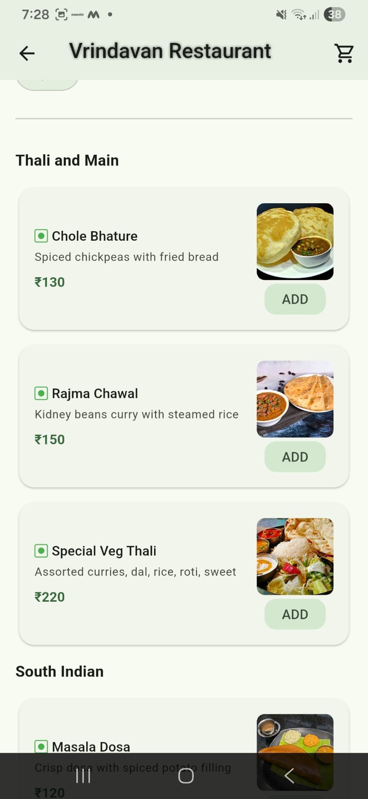
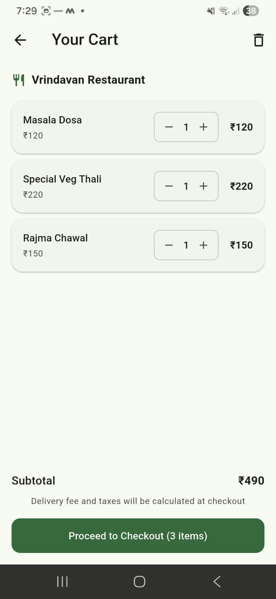
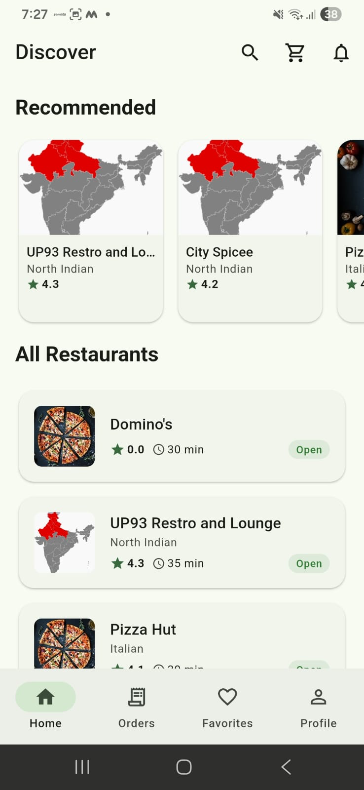
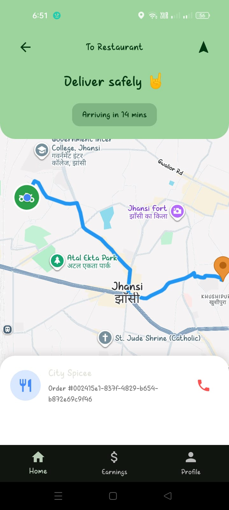
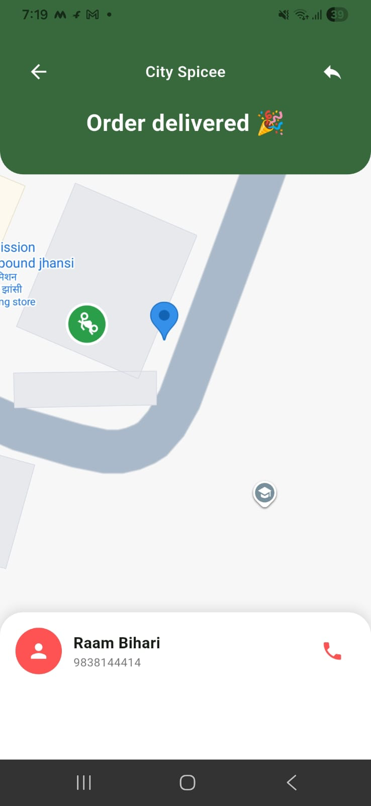
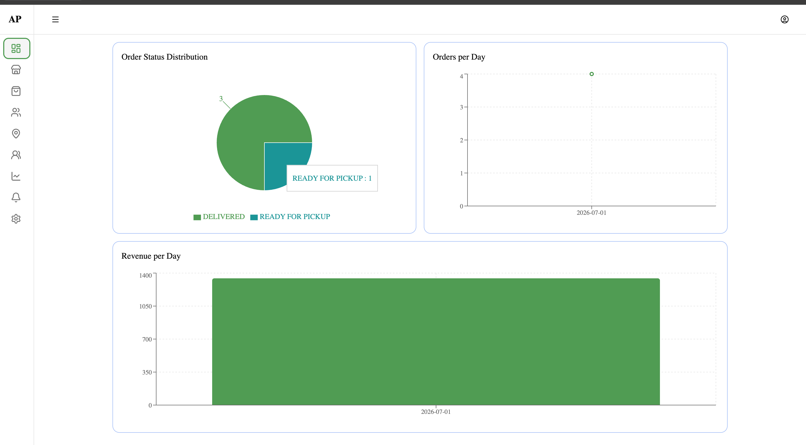
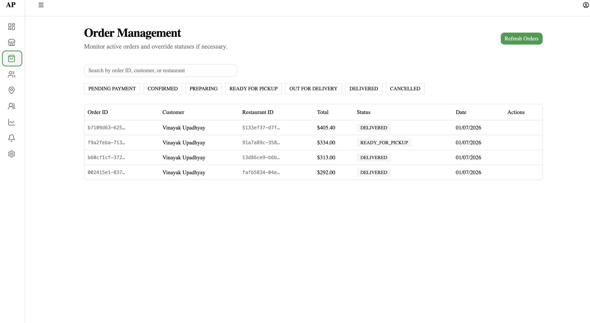
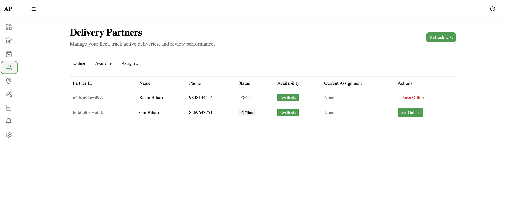

# Distributed Food Delivery System

> A production-grade, event-driven food delivery platform built using **Spring Boot Microservices, Apache Kafka, Redis GEO, PostgreSQL, Flutter, Google Maps and WebSockets**.

This project demonstrates how modern distributed systems are designed for scalability, reliability and real-time communication. It simulates the complete lifecycle of a food delivery platform—from order placement to live delivery tracking—using asynchronous messaging and microservice architecture.

---


#  Microservices

| Service | Responsibility |
|----------|---------------|
| Auth Service | Authentication & JWT |
| Restaurant Service | Restaurant & Menu Management |
| Order Service | Order Lifecycle |
| Payment Service | Payment Processing |
| Delivery Service | Rider Assignment & Delivery Lifecycle |
| Tracking Service | Live Rider Tracking |
| API Gateway | Central Entry Point |

Each microservice owns its own database and communicates through events.

---

---

#  Features

##  Customer Application

- User Authentication (JWT)
- Browse Restaurants
- Browse Menus
- Place Orders
- Real-Time Order Status
- Live Delivery Tracking
- Google Maps Integration
- Live Rider Location
- Delivery ETA
- Order History

---

##  Delivery Partner Application

- Delivery Partner Authentication
- Go Online / Offline
- Live GPS Sharing
- Google Maps Navigation
- Order Assignment
- Pickup Confirmation
- Delivery Confirmation
- Real-Time Location Updates

---

##  Restaurant Management

- Restaurant Registration
- Menu Management
- Order Queue
- Update Food Preparation Status
- Ready For Pickup Workflow

---

##  Admin Dashboard 

- Restaurant Management
- Delivery Partner Monitoring
- Live Rider Map
- Active Order Monitoring
- Analytics Dashboard

---

#  Architecture

This project follows an **Event-Driven Microservices Architecture**.

Instead of tightly coupling services through REST APIs, domain events are exchanged using Apache Kafka.

```
                 +--------------------+
                 |    API Gateway     |
                 +---------+----------+
                           |
        -----------------------------------------
        |        |        |        |            |
      Auth   Restaurant  Order   Payment   Delivery
        |        |        |        |            |
        --------------- Kafka -------------------
                           |
                      Tracking Service
                           |
                      WebSocket Server
                           |
                Customer & Delivery Apps
```


#  Event Driven Workflow

Example Order Flow

```
Customer Places Order
        │
        ▼
Order Service
        │
        ▼
OrderCreatedEvent
        │
        ▼
Payment Service
        │
        ▼
PaymentCompletedEvent
        │
        ▼
Delivery Service
        │
        ▼
DeliveryAssignedEvent
        │
        ▼
Restaurant Starts Preparing
        │
        ▼
OrderPreparingEvent
        │
        ▼
OrderReadyForPickupEvent
        │
        ▼
OrderPickedUpEvent
        │
        ▼
OrderDeliveredEvent
```


---

#  Transactional Outbox Pattern

To guarantee reliable event publishing, every microservice implements the **Transactional Outbox Pattern**.

Instead of publishing directly to Kafka:

1. Business data is saved.
2. Event is stored inside an Outbox table.
3. Scheduled Publisher reads unpublished events.
4. Event is published to Kafka.
5. Event is marked as published.

This guarantees consistency even if Kafka is temporarily unavailable.

---

#  Apache Kafka

Implemented Concepts

- Kafka Producers
- Kafka Consumers
- Consumer Groups
- Partitions
- Dead Letter Topics
- Retry Topics
- Event Choreography
- Idempotent Consumers
- Error Handling
- JSON Serialization

---

#  Redis GEO

Redis GEO is used for **nearest rider assignment**.

Instead of querying PostgreSQL for rider locations:

```
Delivery App
      │
      ▼
GPS Updates
      │
      ▼
Redis GEO
      │
      ▼
Nearest Rider Search
      │
      ▼
Delivery Assignment
```

This enables fast location queries suitable for real-time systems.

---

#  Google Maps Integration

Customer App

- Restaurant Locations
- Rider Marker
- Live Delivery Tracking
- Route Visualization
- ETA

Delivery App

- Current Location
- Navigation
- Customer Route
- Restaurant Route

---

#  Real-Time Tracking

Location updates are streamed through WebSockets.

```
Delivery App
      │
GPS Update
      │
      ▼
Tracking Service
      │
WebSocket
      │
      ▼
Customer App
```

Customers can see the rider moving in real time.

---

#  Security

- JWT Authentication
- BCrypt Password Encryption
- Stateless Authentication
- Role Based Authorization
- API Gateway Security

Roles

- Customer
- Restaurant Owner
- Delivery Partner

---

#  Technology Stack

## Backend

- Java 21
- Spring Boot
- Spring Security
- Spring Data JPA
- Spring Cloud Gateway
- Spring Scheduler
- PostgreSQL
- Apache Kafka
- Redis
- WebSockets
- OpenFeign

---

## Mobile

- Flutter
- Dio
- Google Maps
- Geolocator
- WebSocket
- Material 3

---

## Database

- PostgreSQL
- Redis GEO

---

## Messaging

- Apache Kafka

---

## Authentication

- JWT
- BCrypt

---

#  Project Structure

```
food-delivery-system/

├── api-gateway/
├── auth-service/
├── restaurant-service/
├── order-service/
├── payment-service/
├── delivery-service/
├── tracking-service/
├── customer-app/
├── delivery-app/
└── admin-web/
```

---

#  Engineering Concepts Demonstrated

- Microservices
- Event-Driven Architecture
- Transactional Outbox Pattern
- API Gateway Pattern
- Repository Pattern
- Clean Architecture
- JWT Authentication
- Redis GEO
- Google Maps
- WebSockets
- Event Choreography
- Distributed Systems
- Idempotent Consumers
- Retry & Dead Letter Topics
- REST APIs
- DTO Pattern

---

#  Screenshots

## Customer App






---

## Delivery Partner App





---

## Admin Dashboard







---

#  Purpose

I wanted to learn and understand how distributed systems work behind the servers so i decided to code them myself. It was complex but also very exciting for me to learn something new which no fresher actually works on..

It focuses on production-grade backend design rather than simple CRUD functionality, demonstrating asynchronous messaging, reliable event processing, distributed state management, and live location tracking across multiple independent services.
